# apparness ハーネス 完全ガイド

このリポジトリ（`apparness`）に構築した「どんなアプリでも Claude Code 駆動で自動生成できるハーネス」の説明書です。思想、使い方、フェーズごとにどのエージェント・スキル・フックが動くか、それぞれが何を読み込むか、決定論的に強制される部分とAIの判断に委ねられる部分の境界、ブランチ運用とその制限をまとめています。

作成日: 2026-08-20 / 更新日: 2026-08-21 / 対象バージョン: v1（`main` ブランチ時点）

v0（要件定義〜組み上げの一気通貫、Hooks Rule 1〜7）に加え、v1 で以下を追加済み:
フェーズ節目のコミット強制（Rule 8）・`status.yaml` 状態遷移の妥当性チェック（Rule 9、
`BLOCKED` 経由の抜け穴も封鎖）・Bash 経由の間接書き込みの実ブロック化と**事後検証**・
CI 連携（12節）・依存ライブラリの脆弱性スキャン（13節）・**検証コマンドの宣言 → 実行 → 受領書
→ Rule 10**（14節）・**契約と要件の機械検証**（15節）・**独立レビューア**（16節）・
**スタックパック規約**（17節）・ハーネス自身の pytest（12節）。未着手の項目は `ROADMAP.md`
「v1 で着手予定の項目」を参照。

---

## 目次

1. [思想](#1-思想)
2. [全体像（ディレクトリマップ）](#2-全体像ディレクトリマップ)
3. [ワークフロー全体図](#3-ワークフロー全体図)
4. [フェーズ詳細](#4-フェーズ詳細)
5. [Hooks が強制する10のルール（決定論レイヤー）](#5-hooks-が強制する10のルール決定論レイヤー)
6. [コンテキスト消費マップ](#6-コンテキスト消費マップ)
7. [決定論 vs AI判断 対照表](#7-決定論-vs-ai判断-対照表)
8. [ブランチ・worktree 運用とその制限](#8-ブランチworktree-運用とその制限)
9. [品質保証の多層構造](#9-品質保証の多層構造)
10. [自動化モード（AUTONOMY.yaml）](#10-自動化モードautonomyyaml)
11. [既知の制約・v1以降の拡張候補](#11-既知の制約v1以降の拡張候補)
12. [CI連携（サーバーサイド二重チェック）](#12-ci連携サーバーサイド二重チェック)
13. [依存ライブラリの脆弱性スキャン（OSV-Scanner）](#13-依存ライブラリの脆弱性スキャンosv-scanner)
14. [検証コマンドの宣言・実行・受領書（Rule 10）](#14-検証コマンドの宣言実行受領書rule-10)
15. [契約の機械検証（interfaces 突合・要件トレーサビリティ）](#15-契約の機械検証interfaces-突合要件トレーサビリティ)
16. [独立レビューア（gate-reviewer）](#16-独立レビューアgate-reviewer)
17. [スタックパック（スタック固有の標準の外部化）](#17-スタックパックスタック固有の標準の外部化)
18. [CONVENTIONS.md から移設した設計意図・背景](#18-conventionsmd-から移設した設計意図背景)

---

## 1. 思想

アプリ作成を AI エージェントに任せると、コンテキストが肥大化するほど精度が落ち、また「約束事項」がAIの自己申告だけに頼ると守られたり守られなかったりが安定しない、という2つの問題が起きます。このハーネスは次の原則でこれに対応します。

| 原則 | 内容 |
|---|---|
| **最小機能単位への分割** | アプリを「入出力さえわかれば内部を知らなくてよい」独立機能に分割し、機能ごとにコンテキストをクリアして作業する |
| **契約ファースト** | 各機能の入出力は `contract.yaml` として先に確定・凍結し、実装はそれだけを見て進められるようにする |
| **並行作業前提** | 機能ごとに `git worktree` を切り、複数人（または複数セッション）が同時に別機能へ取り組める |
| **中断・再開性** | いつ止めても `STATE.machine.yaml`（機械向け）と `PROGRESS.md`（人間向け、自動生成）を見れば続きから再開できる |
| **上位文書優先** | 要件定義 > 設計 > 機能契約の順で重要度が高く、下位だけを直して上位を放置することを許さない |
| **決定論的な強制** | 「守ってほしいこと」は可能な限り Hooks（Pythonスクリプト）で機械的に強制し、AIの遵守任せにしない |
| **ハーネスと生成物の分離** | `harness/`・`.claude/` はテンプレート本体で書き込み保護の対象。生成物は `apps/<app-id>/` に閉じる |

---

## 2. 全体像（ディレクトリマップ）

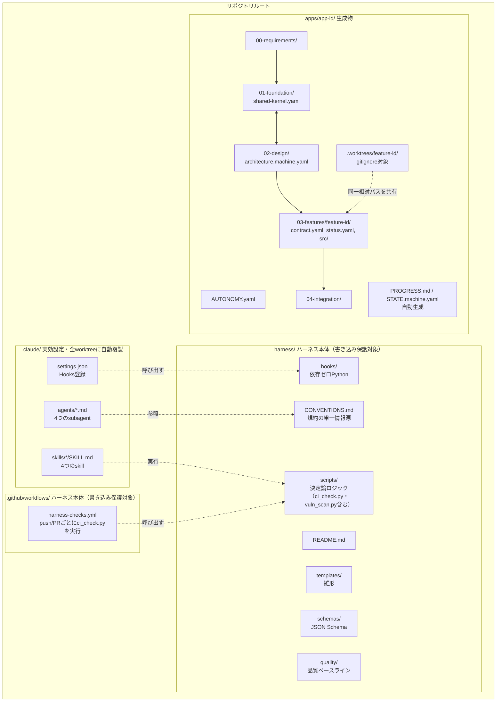

- `.claude/`・`harness/`・`.github/` を合わせて「ハーネス本体」と呼びます。テンプレートとして繰り返し使い回すことを想定しており、アプリ作成中は原則書き込み禁止です（[8節](#8-ブランチworktree-運用とその制限)）。
- `apps/<app-id>/` はアプリ作成のたびに `init-app` skill が生成する成果物です。

---

## 3. ワークフロー全体図

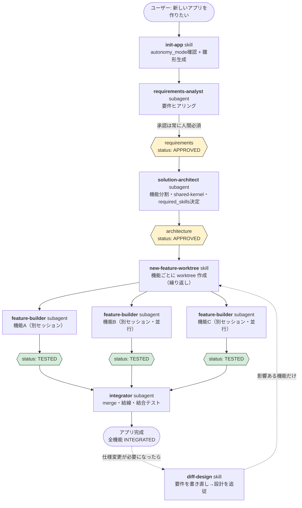

いつ中断しても、`apps/<app-id>/STATE.machine.yaml`（機械向け）と `PROGRESS.md`（人間向け）を見ればどこで止まっているか・次に何をすべきかが分かります。この2ファイルは `render_progress.py` による自動生成で、手書きはしません。

---

## 4. フェーズ詳細

各フェーズについて、①いつ使われるか ②読み込む/参照するファイル（コンテキスト消費の源） ③決定論的に実行される部分とAIが判断する部分、を整理します。

### 4.1 `init-app` skill

| 項目 | 内容 |
|---|---|
| 使われるタイミング | 新規アプリ作成の開始時。ユーザーが「新しいアプリを作りたい」と言ったとき |
| 読み込むファイル | `harness/CONVENTIONS.md` 9節（自動化モードの説明） |
| 実行するスクリプト | `harness/scripts/new_app_scaffold.py`（**決定論**：雛形一式の生成、`AUTONOMY.yaml`・`00-requirements/`・`01-foundation/`・`02-design/`・`04-integration/` を作成し `render_progress.py` を呼ぶ） |
| AIが判断する部分 | `app_id`/`app_name` の確認、`AskUserQuestion` での `autonomy_mode` 確認（未回答なら `SUPERVISED` を既定にしてよい） |
| 決定論的な部分 | 雛形ファイルの内容そのもの（テンプレートから生成、AIは中身を作文しない） |
| 完了後のコミット | `git add -A && git commit`（AIが実行するが、内容は雛形そのものなので実質固定的） |

### 4.2 `requirements-analyst` subagent

| 項目 | 内容 |
|---|---|
| 使われるタイミング | `init-app` の直後。要件定義フェーズ |
| tools | Read, Write, Edit, Glob, Grep, AskUserQuestion, Bash |
| 読み込むファイル | `harness/CONVENTIONS.md`（全文）、`apps/<app-id>/00-requirements/requirements.md`・`requirements.machine.yaml` |
| 触ってよい範囲 | `apps/<app-id>/00-requirements/` 配下のみ |
| 実行するスクリプト | `harness/scripts/validate_yaml.py`（**決定論**：`requirements.schema.json` に対する検証。更新のたびに実行） |
| AIが判断する部分 | ユーザーとの対話内容（目的・ゴール・機能要件など）、`open_questions` が解消されたかの判断 |
| **決定論で強制される部分** | ①`status: APPROVED` にする際、`approved_by`/`approved_at` が空だと **JSON Schema の `if/then` 制約で弾かれる**。②**要件定義の承認だけは `AUTONOMY.yaml` のモードに関わらず常に人間の明示的な返答が必須**（ただしこれ自体はプロンプト上の指示であり、Hookによる強制ではない＝AIの遵守に依存する） |

### 4.3 `solution-architect` subagent

| 項目 | 内容 |
|---|---|
| 使われるタイミング | 要件承認後。設計フェーズ |
| tools | Read, Write, Edit, Glob, Grep, Bash, WebSearch, WebFetch, AskUserQuestion |
| 読み込むファイル | `harness/CONVENTIONS.md`（6, 9, 10, 11節）、`apps/<app-id>/AUTONOMY.yaml`、`00-requirements/requirements.machine.yaml`、`harness/quality/security-baseline.md` |
| 触ってよい範囲 | `apps/<app-id>/01-foundation/` と `02-design/` のみ |
| 進め方の特徴 | `shared-kernel.yaml`（共通部分）と `architecture.machine.yaml`（機能分割）を**逐次ではなく反復**して収束させる（[CONVENTIONS.md 11節](harness/CONVENTIONS.md)） |
| AIが判断する部分 | 機能分割案、技術スタック選定（ライセンス・脆弱性をWebSearchで調査）、`required_skills[]` に追加するかどうかの判断 |
| **決定論で強制される部分** | ①`status: APPROVED` 時の `approved_by`/`approved_at` 必須（スキーマ）。②**`based_on_requirements_version` が要件の現在の `version` と一致しないと Hook が APPROVED への変更自体を拒否**（Rule 7、正真正銘のブロック）。③APPROVED後は `contract.yaml`（設計時ドラフト）が凍結され Hook が書き込みを拒否（Rule 3） |
| 実行するスクリプト | `harness/scripts/validate_yaml.py` |

### 4.4 `new-feature-worktree` skill

| 項目 | 内容 |
|---|---|
| 使われるタイミング | 設計承認後、機能ごとに実装へ着手するとき（繰り返し実行） |
| 実行するスクリプト | `harness/scripts/new_feature_scaffold.py`（**決定論**：`architecture.machine.yaml` が APPROVED か検証 → `git worktree add` → `SPEC.md`/`contract.yaml`/`status.yaml`/`src/`/`tests/`/`.claude/` を生成 → 初期コミット） |
| AIが判断する部分 | `app_id`/`feature_id` の確認のみ。生成内容自体はテンプレート駆動 |
| 決定論的な部分 | worktree のパス・ブランチ名は固定規則（[8節](#8-ブランチworktree-運用とその制限)）。冪等（既存なら再利用） |

### 4.5 `feature-builder` subagent

| 項目 | 内容 |
|---|---|
| 使われるタイミング | 機能ごとの worktree 内で、担当者が新規セッションを開始したとき |
| tools / skills | Read, Write, Edit, MultiEdit, Bash, Glob, Grep, Skill, Task／`skills: code-review`（frontmatterでプリロード） |
| 読み込むファイル | `SPEC.md`、`contract.yaml`、`status.yaml`、`apps/<app-id>/AUTONOMY.yaml`、`harness/quality/security-baseline.md`、（UIありなら）`harness/quality/design-baseline.md`、`../../01-foundation/shared-kernel.yaml`（`required_skills[]` 確認用） |
| 触ってよい範囲 | 自分の `03-features/<feature-id>/` 配下のみ |
| AIが判断する部分 | 実装そのもの、テスト内容、レビュー指摘への対応 |
| **決定論で強制される部分** | ①他機能・要件・共有基盤・設計・ハーネス本体への書き込みは **すべて Hook が拒否**（Rule 1, 2, 6）。②**`src/**` への最初の書き込み時、`required_skills[]` の各Skillが有効化されていなければ実装そのものをブロック**（Rule 5）。③承認済み `contract.yaml` は凍結され書き込み拒否（Rule 3）。④**`TESTED` にするには、宣言された検証コマンドを実際に実行した受領書が必要**（Rule 10、14節）。受領書の手書きも拒否される |
| 実行するSkill / subagent | `code-review`（bundled）＋ `run_verification.py`（受領書の生成）＋ `gate-reviewer` subagent（独立レビュー、16節）。いずれも `TESTED` にする前 |

### 4.6 `integrator` subagent

| 項目 | 内容 |
|---|---|
| 使われるタイミング | 全機能が `TESTED` 以上になった後。メインの worktree（リポジトリ本体）で実行 |
| tools / skills | Read, Write, Edit, Bash, Glob, Grep, Skill／`skills: security-review, code-review` |
| 読み込むファイル | `STATE.machine.yaml`、`architecture.machine.yaml`（`interfaces[]`）、`harness/quality/security-baseline.md`・`design-baseline.md`、`shared-kernel.yaml`（`required_skills[]`） |
| 触ってよい範囲 | 各 feature ブランチの merge、`04-integration/` 配下の結線・テストコード作成 |
| AIが判断する部分 | 結線コードの書き方、結合テストのシナリオ設計 |
| **決定論で強制される部分** | ①merge 前に `check_interfaces.py` で `interfaces[]` の両端の JSON Schema 整合を確認（CI 項目 J でも再検証。15節）。②統合完了直前に `security-review`・`code-review` の実行が手順として必須（プロンプト指示。見つからなければ報告のみで先に進める＝Hookではなく運用ルール） |
| 完了条件 | 結合テストコードを `04-integration/` に資産として残すこと。`integration.md` に手順・結線箇所・テスト結果を記録 |

### 4.7 `diff-design` skill

| 項目 | 内容 |
|---|---|
| 使われるタイミング | 仕様変更・要件追加が必要になったとき |
| 手順 | ①`requirements-analyst` で変更ヒアリング → 旧要件を `00-requirements/history/` に退避 → `version` インクリメント → 承認。②`solution-architect` で新設計（`based_on_requirements_version` 更新）→ 旧設計を `02-design/history/` に退避。③`diff_architecture.py` で機能差分算出（**決定論**）。④変更機能のみ新規 `feature-id` で `new-feature-worktree`、変更なしは再利用 |
| **決定論で強制される部分** | 新しい `architecture.machine.yaml` を APPROVED にする際、Rule 7 が要件versionとの整合性を検証 |

### 4.8 `sync-progress` skill

| 項目 | 内容 |
|---|---|
| 使われるタイミング | 進捗を手動で強制リフレッシュしたいとき（通常は Rule 4 が自動実行するため不要） |
| 実行するスクリプト | `harness/scripts/render_progress.py --app <id>` または `--all`（完全決定論） |

---

## 5. Hooks が強制する10のルール（決定論レイヤー）

`harness/hooks/pre_tool_use_guard.py`（PreToolUse）・`post_tool_use_sync.py`（PostToolUse）・`stop_commit_guard.py`（Stop/SubagentStop）で実装。**依存ゼロの標準ライブラリのみ**で動作し、ツール呼び出し・応答終了のたびに毎回起動されます。

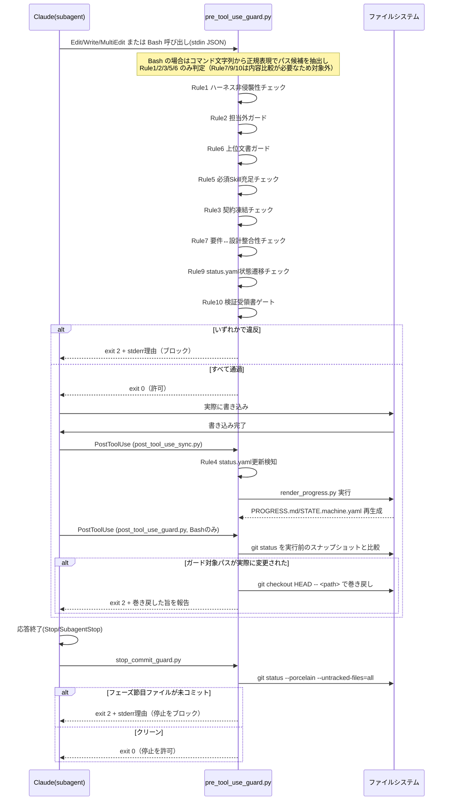

| # | ルール名 | 何を見るか | ブロック条件 |
|---|---|---|---|
| 1 | ハーネス非侵襲性 | `harness/**`, `.claude/**`, `.github/**` への書き込み | 現在のブランチが `harness/` プレフィックスでない（`.claude/settings.local.json` は例外） |
| 2 | 担当外ガード | `03-features/<id>/**`（`status.yaml`除く） | 現在の worktree のルート basename が `<id>` と不一致 |
| 3 | 契約凍結 | `contract.yaml` | 対応する `status.yaml` の `state` が `CONTRACT_DRAFTED` を超えている |
| 4 | 進捗自動再生成 | `status.yaml` の更新（PostToolUse） | 常に非ブロッキングで `render_progress.py` を実行 |
| 5 | 必須Skill充足ゲート | `03-features/<id>/src/**` | `shared-kernel.yaml` の `required_skills[]` の `plugin_ref` が `enabledPlugins` に無い |
| 6 | 上位文書ガード | feature用worktreeからの `00-requirements/`・`01-foundation/`・`02-design/` | 常にブロック（メインworktreeからは対象外） |
| 7 | 要件↔設計整合性 | `architecture.machine.yaml` を `APPROVED` にする書き込み | `based_on_requirements_version` ≠ `requirements.machine.yaml` の現在の `version` |
| 8 | フェーズ節目のコミット強制 | `status.yaml`/`requirements.machine.yaml`/`architecture.machine.yaml`（Stop/SubagentStop） | いずれかが `git status --porcelain --untracked-files=all` で未コミット |
| 9 | 状態遷移の妥当性チェック | `status.yaml` の `state` 書き換え | 書き込み前後の `state` が妥当な遷移でない（直線状態の後退・複数段階の飛び越し、終端状態からの変更）。`BLOCKED` からの復帰は `state_history[]` を遡って直前の実質的な状態から判定する |
| 10 | 検証受領書ゲート | `status.yaml` を `TESTED` にする書き込み／`verification_receipt` の書き換え | 受領書が無い・宣言されたコマンドが `exit_code: 0` でない・受領書の `commit` が現在の HEAD と不一致／受領書を Edit/Write で書き換えようとした（14節） |

**判定対象のパスは、`.worktrees/` を通る場合その worktree を基準に読み替えてから Rule に掛けます**
（`path_utils.resolve_worktree_scope`）。8節のとおり worktree の実体は
`apps/<app>/.worktrees/<feature-id>/` にあり、その中に同じ `apps/<app>/03-features/<feature-id>/`
という相対パスが再び現れます。メインの worktree から見た相対パスは接頭辞ぶんだけ深くなるため、
読み替えをしないと `^apps/.../03-features/...` にアンカーされた Rule 1・2・3・5・9・10 が
まとめて素通りします。ドッグフーディングで実証したもので、メインセッションから**受領書なしで
`state: TESTED` を書き込めていました**（`DOGFOODING-LOG.md` F-029/F-030）。しかも `.worktrees/` は
メインリポジトリの `.gitignore` 対象なので `git status` に現れず、事後検証による巻き戻しも
働きませんでした——静的検知と事後検証の二段構えが、どちらもこの経路では機能していなかったことになります。
読み替えにより、どのセッションから書いても同じ Rule が同じ意味で効きます。worktree の中から
書いている場合は接頭辞が現れないため、読み替えは恒等写像です。

さらに、**Bash については実行後の事後検証**も行います（`post_tool_use_guard.py`、PostToolUse）。
静的解析では原理的に検知できない書き込み（変数展開されたパス `>> "$VAR"`、`xargs`、
スクリプト経由など）を、Bash 実行前後の `git status` の比較で確実に検出し、ガード対象パスへの
変更であれば**巻き戻して**報告します。実行前から未コミットだったパスは巻き戻しません
（Claude Code の外で行われた人間の編集を破壊しないため）。静的検知（未然防止）と
事後検証（確実な検知）の二段構えです。

**Edit/Write/MultiEdit/NotebookEdit** に加え、**Rule 1・2・3・5・6 は `Bash` 経由の間接書き込み**（`sed -i` / `cp` / `mv` / `tee` / リダイレクト等）**もブロック**します（v1。`shlex` によるクォート考慮トークン化で判定するため、クォート内の文字列（`echo "a >> b"` の `>>` 等）を演算子と誤認識しない。トークン化前にクォート・行継続・ヒアドキュメント本体を考慮して改行をコマンド区切りへ正規化するため、複数行の Bash コマンドで `cp`/`mv`/`tee`/`sed -i` が先頭行以外にある場合も検知する。変数展開されたパス等の検知漏れは残るが許容する。**バイパス用の環境変数は意図的に用意しない**——AIがブロックされた際に自ら解除できてしまうと決定論的強制が崩れるため。Rule 7・9・10 は書き込み前後の内容比較が必要なため Bash 経由では判定対象外）。Rule 8 は例外的に `Stop`/`SubagentStop` イベントで動作し、ツール呼び出しではなく応答終了そのものをブロックします。Rule 9 は `BLOCKED` から復帰するとき、`state_history[]` を時刻順に遡って直前の非 `BLOCKED` 状態を復元し、そこからの遷移として判定します（`BLOCKED` を経由した飛び越しはできません）。

---

## 6. コンテキスト消費マップ

各エージェント・スキルが「常時（起動時に必ず）」読むファイルと「条件付き」で読むファイルを分けています。`harness/CONVENTIONS.md` は全 subagent が起動時に読むため、これが実質的な「共通の最低コンテキストコスト」になります。**この量は設計制約として扱い、CI が機械的に上限を強制します**（後述「コンテキスト予算」）。

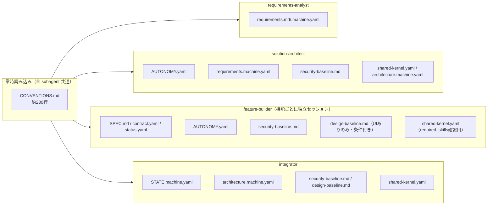

| Subagent / Skill | 常時読むファイル | 条件付きで読むファイル |
|---|---|---|
| `requirements-analyst` | `CONVENTIONS.md`, `requirements.md`, `requirements.machine.yaml` | なし |
| `solution-architect` | `CONVENTIONS.md`, `AUTONOMY.yaml`, `requirements.machine.yaml`, `security-baseline.md` | WebSearch結果（ライブラリ調査時） |
| `feature-builder` | `CONVENTIONS.md`, `SPEC.md`, `contract.yaml`, `status.yaml`, `AUTONOMY.yaml`, `security-baseline.md`, `shared-kernel.yaml` | `design-baseline.md`（UIを持つ機能のみ） |
| `integrator` | `CONVENTIONS.md`, `STATE.machine.yaml`, `architecture.machine.yaml`, `security-baseline.md`, `shared-kernel.yaml` | `design-baseline.md`（UIありのみ） |
| `init-app` skill | `CONVENTIONS.md` 9節相当 | なし |
| `new-feature-worktree` skill | `architecture.machine.yaml`（features[]確認のみ） | なし |
| `diff-design` skill | `CONVENTIONS.md` 11節相当 | 旧バージョンのrequirements/architecture（history/） |

**設計上の意図**: `harness/quality/*.md`（品質ベースライン）・`harness/STACK_PACK.md` は `CONVENTIONS.md` に内容を埋め込まず、該当フェーズでのみ `Read` される別ファイルにしています。これにより、品質基準を使わないフェーズ（例: `requirements-analyst`）では一切コンテキストを消費しません。

### コンテキスト予算（CI 項目 L）

「常時読み込み量を意識する」は、意識だけでは守れません。`ci_check.py` の項目 L が
機械的に上限を強制します（単一の情報源は `CONVENTIONS.md` 15節）。

| 対象 | 上限 |
|---|---|
| `harness/CONVENTIONS.md` | 36,000 バイト |
| `.claude/agents/*.md` 各ファイル | 12,000 バイト |
| `CONVENTIONS.md` ＋ 最大の agent プロンプト（1 セッションの常時コスト） | 46,000 バイト |

上限は「ここまで使ってよい」という許可ではなく、**超えるときに意識的な判断を強制する**ための線です。
上限に当たったら、まず説明・背景・設計意図をこの `HARNESS_GUIDE.md` へ移します
（`CONVENTIONS.md` に残すのは「機械と保守者が従うべき規約そのもの」だけでよい）。
該当フェーズで初めて読まれる文書（`harness/quality/*.md`・`harness/STACK_PACK.md`）は
常時コストではないため、予算の対象外です。

---

## 7. 決定論 vs AI判断 対照表

「確実に実行される（Hookやスクリプトが機械的に強制する）」ものと「AIが妥当と判断して実行する（プロンプト上の指示に依存する）」ものを区別します。後者は AutonomyMode や状況次第で省略・誤判断されうる点に注意してください。

| 動作 | 決定論（Hook/スクリプトで強制） | AI判断（プロンプト依存） |
|---|---|---|
| ハーネス本体への書き込み拒否 | ✅ Rule 1（PreToolUse） | — |
| 担当外機能ディレクトリへの書き込み拒否 | ✅ Rule 2 | — |
| 契約の凍結 | ✅ Rule 3 | — |
| PROGRESS.md/STATE.machine.yaml の再生成 | ✅ Rule 4（PostToolUse） | — |
| 必須Skillが無い実装のブロック | ✅ Rule 5 | — |
| feature-builderの要件/設計への書き込み拒否 | ✅ Rule 6 | — |
| 要件と設計のバージョン不整合を APPROVED にさせない | ✅ Rule 7 | — |
| status.yaml の state 遷移の妥当性（飛び越し・後退・終端状態からの変更） | ✅ Rule 9（`BLOCKED` からの復帰は `state_history[]` を遡って判定） | — |
| `approved_by`/`approved_at` の未入力での承認防止 | ✅ JSON Schema `if/then` | — |
| YAML/JSON構文・スキーマ適合の検証 | ✅ `validate_yaml.py` | — |
| worktree・雛形ファイルの生成 | ✅ `new_app_scaffold.py`/`new_feature_scaffold.py` | — |
| 機能差分の算出 | ✅ `diff_architecture.py` | — |
| **要件定義の最終承認を人間が明示的に行ったか** | ❌ | ⚠️ プロンプトの指示のみ（Hookは対話の意味を判定できない） |
| 自動化モード（MANUAL/SUPERVISED/AUTONOMOUS）に応じた確認頻度 | ❌ | ⚠️ subagentが `AUTONOMY.yaml` を読んで自己判断 |
| 機能分割の粒度・独立性の妥当性 | ❌ | ⚠️ `solution-architect` の設計判断 |
| 技術スタックの安全性（脆弱性・保守状況）評価 | ❌ | ⚠️ WebSearchに基づくAI判断 |
| 宣言された検証コマンド（テスト/ビルド/型チェック/Lint）を実際に実行して通したか | ✅ Rule 10 ＋ 受領書の `commit` 一致（14節） | — |
| テストが空振り（0件）していないか・スキップ率 | ✅ JUnit XML の集計値（`junit_xml` を宣言した場合。14節） | ⚠️ 宣言しない技術を選んだ場合は終了コードのみ |
| 受入基準に対応づけたテストが実在し成功したか | ✅ `test_ids` と JUnit XML の突合（15節） | — |
| MUST 要件の取りこぼし | ✅ CI 項目 K（`covers_requirements`。15節） | — |
| 並行実装した機能間の入出力の食い違い | ✅ CI 項目 J（`interfaces[]` の JSON Schema 突合。15節） | — |
| 実装者以外によるレビューが行われたか | ⚠️ `gate-reviewer` は必須手順だが、実行記録（`status.yaml` の `review`）は証明を持たない（16節） | ⚠️ プロンプト上の必須手順 |
| `security-review`/`code-review` の実行そのもの | ❌ | ⚠️ プロンプト上の必須手順（実行を忘れる/スキップする余地は理論上ある） |
| 実装の正しさ・テストの**内容の**十分性（そのテストが受入基準を実際に検証しているか） | ❌ | ⚠️ `gate-reviewer` の rubric 判定（verdict の集計は機械的だが、指摘そのものはAI判断） |
| 結合テストのシナリオ網羅性 | ⚠️ 接続の型整合は CI 項目 J が担保 | ⚠️ シナリオの選び方は integrator の判断 |
| フェーズ節目（status.yaml等）のコミット実行 | ✅ Rule 8（Stop/SubagentStop） | — |
| コミット内容の妥当性（メッセージ・粒度） | ❌ | ⚠️ プロンプトの指示に依存（コミットが行われること自体はRule 8が強制） |
| Bash経由の間接的な書き込み（Rule1/2/3/5/6相当） | ✅ 静的検知でブロック ＋ 事後検証（`git status` 比較）で巻き戻し（バイパス用環境変数なし） | — |
| 常時読み込みコンテキストの肥大化 | ✅ CI 項目 L（コンテキスト予算。6節） | — |

**読み方**: ✅ は「Claudeが指示に従わなくても、システムが機械的に阻止/実行する」層。⚠️ は「プロンプトに明記されているが、最終的にはAIの遵守に依存する」層です。⚠️ の項目は `PROGRESS.md` の `autonomy_mode` 表示や、人間によるレビューで補完することを前提としています。

**据え置いた項目**: 「機能分割の粒度・独立性の妥当性」と「要件定義の最終承認を人間が行ったか」は、意図的に AI 判断のまま残しています。前者は設計判断であり機械化すると設計の自由度そのものを削ります。後者は Hook が対話の意味を判定できないという構造的な限界です（9節・10節）。

---

## 8. ブランチ・worktree 運用とその制限

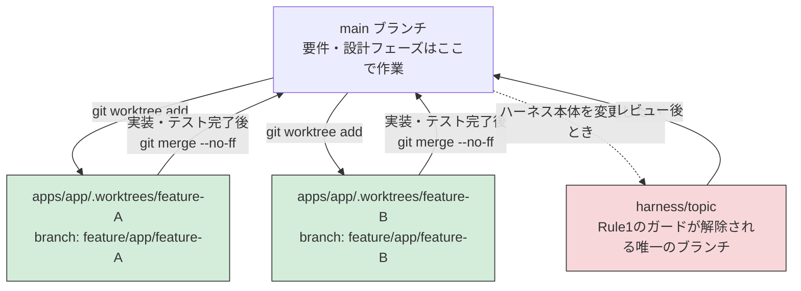

### ブランチ命名規則

| 用途 | 形式 | 例 |
|---|---|---|
| アプリ雛形作成 | `app/<app-id>/bootstrap` | `app/hello-world-todo/bootstrap` |
| 機能実装 | `feature/<app-id>/<feature-id>` | `feature/hello-world-todo/todo-list-api` |
| ハーネス保守 | `harness/<topic>` | `harness/fix-progress-renderer` |
| 統合作業（任意） | `integration/<app-id>` | `integration/hello-world-todo` |

### worktree パス規則

```
apps/<app-id>/.worktrees/<feature-id>/apps/<app-id>/03-features/<feature-id>/   ← 担当者はここをcwdにする
```
git worktree は同一リポジトリの追跡ファイルをそのままチェックアウトするため、worktree内にも `apps/<app-id>/03-features/<feature-id>/` という同一の相対パスが現れます。ルート直下の `.claude/`（hooks/agents/skills）もこの複製に含まれるため、**追加設定なしに全worktreeで同じHooksが有効**になります。

### worktree は隔離機構ではない（F-055）

**git worktree にアクセス制限の機能は無い。** ただのディレクトリであり、そこで動くプロセスは
OS の権限が許す限りどこでも読めるし書ける。`../../../..` でメインリポジトリに到達できる。

隔離を成立させているのは Hook である。worktree が果たしている役割は「壁」ではなく
**「身分証」**——Rule 2 は worktree ルートの basename を見て「このセッションは誰の担当か」を
判定している。

この前提が抜けていたため、実際に穴が開いていた。Hook は書き込み先を**セッションの worktree
ルートからの相対パス**に直してから `^harness/`・`^apps/.../03-features/...` に掛けていたので、
外を指すパスは `../../../../harness/CONVENTIONS.md` のような形になり**どの Rule にもマッチせず
素通りした**。事後検証もセッションの worktree の `git status` しか見ないため拾えなかった。

現在は `path_utils.resolve_write_target` が、書き込み先を**それが属するリポジトリのルート**を
基準に相対化してから Rule に掛ける。Rule 6 だけは「feature 用 worktree からの書き込みか」を
判定する必要があるため、書き込み先ではなく**セッションの cwd** で判定する。
リポジトリの外（`/tmp` 等）は対象外のまま——過剰にブロックしないため。

なお「他機能の内部を知らずに実装できる」という独立性のほうは、Hook ではなく**ブランチ**が
担保している。各機能の実装はそれぞれの feature ブランチにあり、他機能の worktree には
**そもそも存在しない**（`todo-markdown` の worktree に見える機能は `todo-markdown` だけ）。
読もうにも無い、という構造なので、AI の自制には依存していない。

---

### Bash 検知の 2 段構え（詳細）

1. **静的検知（未然防止）**: `shlex` でクォート・行継続・ヒアドキュメントを考慮して
   コマンド文字列から書き込み先を割り出す（`path_utils.extract_bash_candidate_paths`）。
   **変数展開されたパス等の検知漏れは原理的に残る**。
2. **事後検証（確実な検知）**: `post_tool_use_guard.py`（PostToolUse）が、Bash 実行前に保存した
   スナップショットと実行後を比較し、**内容が実際に変わったパス**だけを Rule 1・2・3・5・6 で
   判定する。比較は `git status` の状態コードではなく**内容のハッシュ**で行う——`git add` は
   内容を変えないのに状態コードを変えるため、コードで比較すると誤発火し、正当な編集を
   巻き戻してしまう（F-050 で実際に `open_issues[]` の追記が消えた）。逆に、実行前から dirty な
   ファイルをさらに書き換えてもコードは変わらないため、内容比較でなければ取りこぼす。
   違反があれば**実行直前の内容へ**巻き戻して報告する（exit 2）。HEAD へ戻さないのは、
   実行前からの未コミット変更（人間の編集など）を巻き添えにしないため。
   スナップショットが取れなければ何もしない（安全側）。

**静的検知は削除しない。** 未然に止めるほうが AI にとって学習可能なフィードバックになるためで、
事後検証は最後の砦という位置づけ。代償として Bash ごとに `git status` が 2 回走る。

---

### ブランチによる制限（Rule 1 との関係）

| 現在のブランチ | `harness/**`・`.claude/**`・`.github/**` への書き込み |
|---|---|
| `main` またはその他 | ❌ 拒否（`HARNESS_UNLOCK=1` で一時解除可能） |
| `harness/<topic>` | ✅ 許可 |
| feature用worktree（`feature/...`） | ❌ 拒否。かつ Rule 6 により要件・共有基盤・設計文書も拒否 |

つまり、**ハーネス本体を変更してよいのは `harness/<topic>` ブランチだけ**であり、これはこのガイド自体を作成した今回の作業でも実際に踏んだ制約です（`main` ブランチで `harness/quality/*.md` を書こうとして Hook に拒否され、`harness/quality-baseline` ブランチへ切り替えました）。

---

## 9. 品質保証の多層構造

「専門的な外部Skillが入っていない環境では品質が保証されない」状態を避け、かつ「実装者が自分で自分を通す」ことも避けるための構造です。

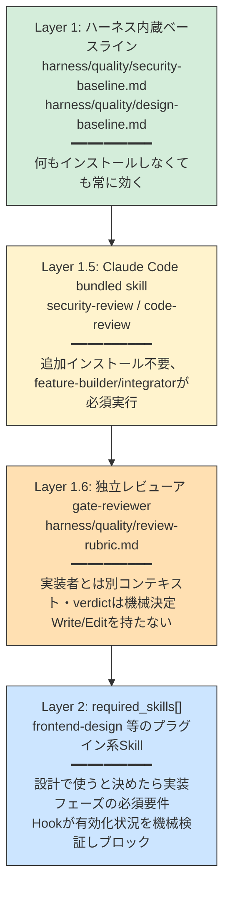

- **Layer 1**は依存ゼロで常に効く最低ライン。`CONVENTIONS.md` には内容を埋め込まず、該当フェーズで初めて `Read` される（コンテキストは必要なときだけ消費）。
- **Layer 1.5**は Claude Code 標準搭載のため基本的に確実。実行を試みて見つからない場合はユーザーに報告して続行（Layer 1 が最低ラインを担保するため）。
- **Layer 1.6** は `feature-builder` の自己レビュー（Layer 1.5）に残る**作者バイアス**を
  打ち消すための独立レビューアです。`state: TESTED` の前に、実装者とは別のコンテキストで
  契約とコードだけを突き合わせます。判断基準は `harness/quality/review-rubric.md` **だけ**、
  verdict は深刻度の集計から機械的に決まり、レビューアは `Write`/`Edit` を持ちません。詳細は 16 節。
- **Layer 2**は「あれば使う」ではなく「**設計で決めたら実装フェーズの必須要件**」という位置づけです。`solution-architect` が `shared-kernel.yaml` の `required_skills[]` に記録すると、`feature-builder` は実装開始前に Hook（Rule 5）で有効化状況を機械的に検証され、欠けていれば実装そのものがブロックされます。`feature-builder` は `shared-kernel.yaml` を書き換えられない（Rule 6）ため、実装中に必要なSkillに独断で気づいても追加できず、`diff-design` での再設計に回る設計です。

---

## 10. 自動化モード（AUTONOMY.yaml）

`apps/<app-id>/AUTONOMY.yaml` が、そのアプリでどこまで人間の承認を必須とするかを定めます。

| モード | 節目ごとの確認頻度 |
|---|---|
| `MANUAL` | 要件承認・設計承認・各機能の完了・統合完了、すべての節目で毎回人間に確認 |
| `SUPERVISED`（デフォルト） | 要件承認は必須。それ以降は妥当なら自動で進めるが、技術スタック選定など重要な決定は都度提示 |
| `AUTONOMOUS` | 明らかにブロッキングな疑問がない限り最後まで確認なしで進める |

**モードに関わらず、要件定義の承認だけは常に人間必須**という固定ポリシーがあります。ただし前述の通り、この「人間が本当に承認したか」の判定はHookでは検証できず、プロンプト上の指示に依存します。`PROGRESS.md` に現在のモードが常時表示されるので、実際の挙動とモード設定が食い違っていないか人間が随時確認できるようにしています。

---

## 11. 既知の制約・v1以降の拡張候補

- CI（12節）はアプリの技術スタックに依存しない範囲の再検証に留まる。**ただし「テストを実際に
  走らせて通したこと」は 14 節の宣言 → 実行 → 受領書の仕組みで非依存のまま強制している。**
  CI 上でアプリのテストを実際に走らせる（実行環境をアプリごとに用意する）ところまでは行っていない。
  受領書の終了コードそのものの偽造は、Claude Code のセッション内では Rule 10 が防ぐが、
  セッション外の編集に対しては検知できない（14節「既知の限界」）
- Rule 9 の `BLOCKED` 経由の抜け穴は塞いだ（`state_history[]` を遡って直前の実質的な状態を
  復元して判定する）。ただし判定は `state_history[]` が正しく追記されていることを前提にする。
  履歴に非 `BLOCKED` のエントリが 1 つも無い場合は判定不能として通す
- Bash 経由の間接書き込みの**静的**検知（`path_utils.extract_bash_candidate_paths`）は、
  変数展開されたパス（例: `>> "$VAR"`）等を原理的に検知できない。これは
  `post_tool_use_guard.py` による**事後検証**（実行後の `git status` との比較。5節）で
  塞いだ。静的検知は未然防止として残してある（AI にとって学習可能なフィードバックになるため）。
  事後検証は「既に書かれたものを巻き戻す」ため、書き込み自体を阻止はできない

- **アプリ非依存性は現時点で「主張」であって検証結果ではない**（`apps/` が存在しない）。
  意図的に遠い 2 スタック（例: Python の CLI ツールと TypeScript の Web アプリ）を通しで生成して
  初めて、14〜15節の宣言インターフェースが本当にスタック非依存かが実証される。
  **1 本だけでは検証にならない**（そのスタックに暗黙に依存した設計になっていても露見しないため）。
  未実施。`ROADMAP.md` 参照
- `gate-reviewer` の審査結果（`status.yaml` の `review`）は記録であって証明ではない。
  検証受領書（14節）と違い実行の裏付けを持たないため、Rule 10 のような機械的ゲートにはしていない
- 「機能分割の粒度・独立性の妥当性」と「要件定義の最終承認を人間が行ったか」は意図的に
  AI 判断のまま据え置いている（7節「据え置いた項目」）

これらは実際にアプリを作ってみながら、必要に応じて拡張する方針です。

**v1 で対応済み**:
- 各フェーズでのコミット実行（`status.yaml`/`requirements.machine.yaml`/
  `architecture.machine.yaml` の未コミット変更を残したまま応答を終えることを `Stop`/`SubagentStop`
  フック（`stop_commit_guard.py`、5節 Rule 8）でブロックする仕組み）
- `status.yaml` の状態遷移の妥当性チェック（`NOT_STARTED` からいきなり `INTEGRATED` にする、
  `CONTRACT_APPROVED` から `NOT_STARTED` に後退させる、といった書き込みを `PreToolUse` フック
  （5節 Rule 9、`path_utils.validate_status_transition`）でブロックする仕組み。
  `BLOCKED` 経由の抜け穴も `state_history[]` を遡ることで塞いだ）
- Bash 経由の間接的な書き込み（`sed -i`/`cp`/`mv`/`tee`/リダイレクト等）の実ブロック化。
  Rule 1・2・3・5・6 相当の違反を検知した場合、警告ではなく `exit 2` で Bash コマンドの実行自体を
  拒否するようにした。当初は誤検知時の回避策として専用の環境変数を用意していたが、
  「AIがブロックされた際に自ら解除して実行できてしまい、決定論的強制の意味が失われる」という
  指摘を受けて撤回し、代わりに検知ロジック自体を `shlex` によるクォート考慮トークン化に置き換えて
  誤検知の原因（クォート内の `>` を演算子と誤認識すること）を解消した。バイパス用の環境変数は
  存在しない（`HARNESS_UNLOCK=1` は Rule 1 専用のまま）
  - **同一セッション内で発見・修正した検知漏れ**: 上記の対応後、Rule 2（担当外ガード）の検証中に
    `mkdir -p apps/.../src\ncp a b apps/.../src/` のような**複数行の Bash コマンドで `cp` が
    先頭行以外にある場合、検知をすり抜ける**ことを実地で発見した。原因は `shlex` が改行を単なる
    空白として読み捨てるため、改行だけで区切られた複数コマンド（Claude Code の Bash ツールが
    渡す典型的な形）が1つの巨大なセグメントに融合し、`_extract_write_targets_from_segment` が
    セグメント先頭トークンだけを `cp`/`mv`/`tee`/`sed -i` と比較する仕組みが先頭行以外のコマンドを
    見落としていたこと。トークン化前に、クォート・行継続（末尾 `\`）・ヒアドキュメント本体を
    考慮しながら「コマンドの区切りとして扱ってよい改行」だけを `;` に正規化する処理
    （`path_utils._normalize_bash_newlines`/`_classify_bash_lines`）を追加して根本的に修正した。
    ヒアドキュメント本体・終端子直前の改行は区切りに変換しないため、本体中に `cp ...` のような
    文字列が含まれていても新たな誤検知（false positive）は生まれない。10件の真陽性・4件の
    真陰性シナリオで検証済み。ブランチ: `harness/fix-bash-guard-newline-segments`。
- CI連携（GitHub Actions）。詳細は12節
- 依存ライブラリの脆弱性スキャン（OSV-Scanner、CI連携）。詳細は13節
- Bash 経由の書き込みの**事後検証**（`post_tool_use_guard.py`）。静的解析では原理的に検知
  できない書き込み（変数展開されたパス等）を、実行前後の `git status` 比較で検出して巻き戻す。詳細は5節
- **ハーネス自身の pytest**（`harness/tests/`、CI の `harness-selftest` ジョブ）。詳細は12節
- **検証コマンドの宣言 → 実行 → 受領書 → Rule 10**。「テストを書いて通した」を AI の自己申告に
  委ねず、アプリ非依存のまま実行ベースで強制する。JUnit XML による空振り・スキップ率の検出も含む。詳細は14節
- **`interfaces[]` の JSON Schema 突合**（CI 項目 J）。並行実装した機能同士の食い違いを統合前に検出。詳細は15節
- **要件 → 機能 → テストのトレーサビリティ**（CI 項目 K ＋ 受領書の `traceability`）。詳細は15節
- **独立レビューア `gate-reviewer`**。実装者とは別コンテキストで契約準拠・テスト十分性を審査し、
  verdict は深刻度の集計から機械的に決まる。詳細は16節
- **スタックパック規約**（`harness/STACK_PACK.md`）。スタック固有の標準をハーネス本体に持ち込まず
  外部プラグインとして接続する。詳細は17節
- **コンテキスト予算の CI 化**（CI 項目 L）。詳細は6節

---

## 12. CI連携（サーバーサイド二重チェック）

`harness/hooks/*.py` の Hook は **Claude Code のセッション内でのみ**効く。人間が直接
`git commit` したり、Claude Code を経由しない別ツールで編集した場合はすり抜けられる。
複数人での共有・配布を前提にすると、「Claude Codeを使った人だけが規約を守る」という状態は
避けたい。そこで `.github/workflows/harness-checks.yml` が `harness/scripts/ci_check.py` を
push・pull_request のたびに実行し、git リポジトリの最終状態（および比較対象コミットとの差分）
に対して Hook ルールの一部を**サーバーサイドで再検証**する。

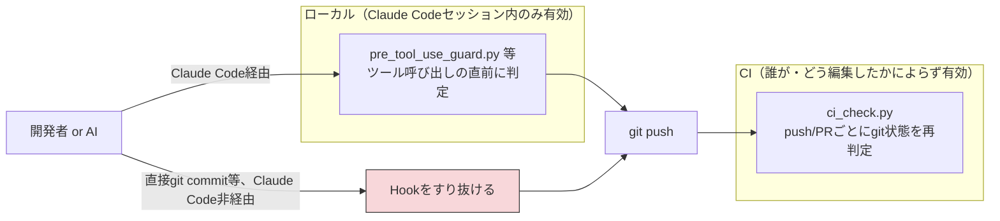

### なぜ「アプリの技術スタックに依存しない範囲」に限定するか

このハーネスは「どんなアプリでも作れる」ことを前提にしており、`apps/` を含まない
`apparness-harness` リポジトリとして配布される（`scripts/sync-harness-template.sh`）。
配布時点でアプリの中身は空なので、feature-builder/integrator が書く単体・結合テスト
（npm test / pytest / go test 等、アプリごとに異なる）を実行する仕組みはテンプレート側に
汎用的に組み込めない。そのため v1 では、**アプリのスタックを問わずに再検証できるもの**
（YAML/JSON Schema・Hookのルール群・進捗ファイルの鮮度）に絞っている。

### チェック内容

`harness/scripts/ci_check.py` が行うチェックと、対応する Hook Rule（7節）:

| # | チェック内容 | 対応する Hook Rule | 判定方法 |
|---|---|---|---|
| A | machine-readable YAML の JSON Schema 検証 | （Hookでは未実施。`validate_yaml.py` を各subagentがBashで手動実行する運用だったものをCIで機械化） | `harness/schemas/*.json` に対して `jsonschema` で検証 |
| B | `harness/**`・`.claude/**`・`.github/**` への変更は `harness/<topic>` ブランチでのみ許可 | Rule 1 | 比較対象コミットとの `git diff --name-status` とブランチ名 |
| C | `feature/<app>/<feature-id>` ブランチは自分の機能ディレクトリ（と任意featureの`status.yaml`）以外を変更できない | Rule 2 / Rule 6 | 同上 |
| D | `contract.yaml` の変更は、対応する状態が凍結ライン未満のときのみ許可 | Rule 3 | 変更ファイル一覧 + 現在の `status.yaml`/`architecture.machine.yaml` |
| E | `architecture.machine.yaml` が `status: APPROVED` のとき `based_on_requirements_version` が一致 | Rule 7 | 最終状態のみで判定（diff不要） |
| F | `status.yaml` の `state` 遷移の妥当性 | Rule 9 | 比較対象コミットの旧内容（`git show`）と現在の内容 |
| G | `PROGRESS.md`/`STATE.machine.yaml` が `render_progress.py` の出力と一致（鮮度） | （Rule 4 のPostToolUse自動再生成を経ずにコミットされていないか） | `render_progress.py` を実行して差分比較（生成日時行は除外） |
| I | `state` が `TESTED`/`INTEGRATED` の機能に妥当な `verification_receipt` があり、検証を実行したコミット以降に実装が変更されていない | Rule 10 | 受領書の `commit` が HEAD の祖先か + `git diff <commit> HEAD -- <機能ディレクトリ>` が空か + 終了コード・JUnit集計値 |
| J | `interfaces[]` の両端の JSON Schema が構造的に整合している | （Hookでは未実施。並行実装中の食い違いを統合前に検出する。15節） | `check_interfaces.py` による型・必須項目・enum の包含関係の比較 |
| K | 要件 → 機能 → テストのトレーサビリティ | （Hookでは未実施。15節） | `check_traceability.py`。MUST 要件の取りこぼし・存在しない FR ID・覆う要件にテストが対応づいていないケース |
| L | コンテキスト予算 | （Hookでは未実施。6節） | `CONVENTIONS.md` と `.claude/agents/*.md` のバイト数を上限と比較 |

Rule 5（必須Skillの充足）は CI 実行環境に Skill 有効化状態という概念が存在しないため、
Rule 8（フェーズ節目のコミット強制）は push された時点で既に全てコミット済みのため、
それぞれ再検証の対象外（再検証しても意味がない）。

**B は `main`/`master` ブランチでは判定しない。** このハーネスは `harness/<topic>` で作業して
`main` へ **fast-forwardマージ**する運用が前提（8節）。fast-forward マージは履歴が線形になるため、
push 時点で「このコミットが元々どのブランチで作られたか」は git 上から判別できない
（正当な `harness/<topic>` の ff マージも、`main` への直接コミットも、diff 上では区別がつかない）。
実際、このワークフローを初めて `main` へ push した際に、それまでの正当な作業がすべて
「`main` で harness/ を直接変更した」と誤検知される問題が起きた。B は `feature/**` 等の
非デフォルトブランチからの push・PR でのみ意味を持つ（feature-builder が担当外のセッションで
harness/ をローカル Hook 経由せず直接編集した場合等はここで検知できる）。

### 判定ロジックの実体はHookと共有

`ci_check.py` は `harness/hooks/lib/path_utils.py` の `validate_status_transition`・
`extract_scalar_field`・`read_state_field` をそのまま import して使う（`hooks/` は依存ゼロの
ため、`scripts/` 側から import しても安全。逆方向——`hooks/` が `scripts/_common.py` 等の
PyYAML依存コードを import すること——は禁止のまま）。これにより、ローカルのHookとCIの
判定基準がズレることを防いでいる。

### ハーネス自身のテスト（`harness-selftest` ジョブ）

`ci_check.py` が検証するのは「ハーネスが**アプリに対して**課すルール」であり、
「ハーネス自身の判定ロジックが正しいか」は別の関心事である。判定ロジック
（`path_utils` の Bash パース・状態遷移判定・受領書検証など）にテストが無いと、
ルールを追加・変更したときに既存の判定を壊したことに気付けない。

そのため `harness/tests/` に pytest を置き、`.github/workflows/harness-checks.yml` の
`harness-selftest` ジョブで実行する。

| ファイル | 対象 |
|---|---|
| `test_path_utils_bash.py` | Bash パース（`_classify_bash_lines`/`_normalize_bash_newlines`/`extract_bash_candidate_paths`）。11節に記録した真陽性10件・真陰性4件の実地シナリオと、旧 `harness/fix-bash-guard-tokenizer` の単一行シナリオをそのまま固定してある |
| `test_status_transition.py` | `validate_status_transition`。5節の状態機械を**テスト側で独立に再実装**し、全状態の直積で突き合わせる（実装の写しではないため、実装だけを変えるとテストが落ちる） |
| `test_path_utils_misc.py` | `simulate_write_result`・`extract_scalar_field`・`extract_required_skills`・`get_enabled_plugins` 等の周辺ヘルパー |
| `test_yaml_parser.py` | hooks 用の依存ゼロ YAML サブセットパーサ。全テンプレートで PyYAML と結果が一致することを固定する |
| `test_verification.py` | 検証コマンドの宣言解決・JUnit XML 解析・受領書の妥当性判定（14節） |
| `test_interface_check.py` | `interfaces[]` の JSON Schema 突合（15節） |
| `test_traceability.py` | 要件 → 機能 → テストのトレーサビリティ判定と、テスト識別子の JUnit XML 突合（15節） |
| `test_context_budget.py` | コンテキスト予算の判定と、**このリポジトリ自身が予算内に収まっていること**（6節） |
| `test_render_progress.py` | `PROGRESS.md`/`STATE.machine.yaml` に出す検証・レビューの要約 |
| `test_pre_tool_use_guard.py` | Hook を実際にサブプロセスとして起動する end-to-end 検証（一時 git リポジトリを作り、payload → 終了コードという Hook の契約そのものを見る） |
| `test_post_tool_use_guard.py` | Bash の事後検証。変数展開されたパスへの書き込みを実際に行って、検出・巻き戻しされること／実行前から dirty だったパスは巻き戻さないことを固定する |

ローカルでの実行:

```
pip install -r harness/requirements-dev.txt
python3 -m pytest harness/tests -q
```

**ハーネスの判定ロジックを変更するときは、必ず先にこのテストを緑にしてから進めること。**

### トリガーとブランチ保護

`.github/workflows/harness-checks.yml` は `push`（全ブランチ）と `pull_request` の両方で
起動する。**現時点ではブランチ保護ルール（CI成功をマージ必須にする）は設定していない**
（GitHub側のリポジトリ設定変更は影響範囲が大きいため、可視化のみに留めている。必須化したい
場合は別途相談）。

---

## 13. 依存ライブラリの脆弱性スキャン（OSV-Scanner）

`apps/<app-id>/` 配下で使われる依存ライブラリ（npm・pip・その他のパッケージマネージャ）に
既知の脆弱性が無いかを、[OSV-Scanner](https://github.com/google/osv-scanner) を使って
push・PR のたびに機械的に再検証する（`harness/scripts/vuln_scan.py`、
`.github/workflows/harness-checks.yml` の `vuln-scan` job）。

### なぜ npm audit / pip-audit を個別に統合しないか

このハーネスは「どんなアプリでも作れる」ことを前提にしており、`solution-architect` が
どの言語・パッケージマネージャを選ぶかは設計フェーズで初めて決まる（12節で述べた
「配布時点でアプリの中身は空」という制約と同根）。`npm audit`・`pip-audit` はそれぞれ
npm・pip というエコシステム固有の CLI であり、対応エコシステムを増やすたびにハーネス側の
出し分けロジックが増える。OSV-Scanner はディレクトリを再帰的に走査して見つかった lockfile
（`package-lock.json`・`requirements.txt`・`poetry.lock`・`Cargo.lock`・`go.sum` 等）の
種類を自動判別し、OSV データベースに一括照会する単一のツールであり、ハーネス側がエコシステムを
列挙する必要がない。ROADMAP.md では「npm audit/pip-audit/OSV等」を候補として挙げていたが、
検討の結果 v1 では OSV-Scanner 一本を採用した。

### なぜ Hook ではなく CI に置くか

`harness/hooks/*.py` は「依存ゼロの標準ライブラリのみ」（5節）で、ツール呼び出しのたびに
毎回起動される決定論レイヤーである。OSV-Scanner は外部バイナリであり、既定では OSV.dev への
問い合わせにネットワークアクセスを要する。これを `PreToolUse` Hook に組み込むと、Edit/Write
のたびにネットワーク越しの脆弱性DB照会が走ることになり、「低コストで毎回確実に効く」という
Hook 層の前提そのものを壊す。そのため 12節と同じ判断で、CI 側にのみ置く。

### 位置づけ（9節の品質保証の多層構造との関係）

`security-review`/`code-review` bundled skill（Layer 1.5）と同じ「入っていれば使う、
入っていなければ報告して続行する」という非致命的な位置づけにする。`vuln_scan.py` は
`osv-scanner` バイナリが見つからない場合、エラーにはせずその旨を報告して exit 0 で抜ける。
CI ワークフロー側では `vuln-scan` job が毎回バージョン固定（チェックサム検証付き）で
インストールしてから呼ぶため、CI 上では実質的に必ず実行される。ローカルで開発者が
`osv-scanner` を任意にインストールしていれば `python3 harness/scripts/vuln_scan.py`
（または `--app <app-id>`）でそのまま手元でも実行できる（`ci_check.py`・
`validate_status_transition.py` と同じ「人間/CI 両対応」の設計）。

### スコープと既知の簡略化

- 走査対象は `apps/` 配下のみ。ハーネス自身が使う Python 依存
  （`harness/requirements.txt` の pyyaml/jsonschema）は対象外
  （このスキャンは「生成されるアプリ」の依存が対象で、ハーネス自体の保守用依存ではないため）。
- 機能ごとに独立した worktree（`03-features/<id>/`）や統合後の `04-integration/assembly/` を
  区別せず、`apps/` 全体を横断的に再帰走査する。feature 境界を意識する必要はない
  （6節の「入出力さえわかれば内部を知らなくてよい」独立性の原則と整合的）。
- 脆弱性が1件でも見つかれば `vuln-scan` job は失敗（exit 1）するが、12節と同様に
  ブランチ保護は設定していないため、現時点ではマージを機械的にブロックはしない
  （可視化のみ）。深刻度（CVSS）によるしきい値判定や、対応不能な既知の脆弱性を
  個別に無視するアローリスト機構は v1 では持たない。必要になれば
  `osv-scanner` 自体の `--config`（`osv-scanner.toml` によるignore設定）を
  `vuln_scan.py` から渡せるようにする拡張が考えられる（未着手）。
- Rule 5・8 と同様、CI 実行環境に閉じた話であり、Hook との二重化は行わない
  （そもそも Hook 側にこのチェックは存在しない）。

---

## 14. 検証コマンドの宣言・実行・受領書（Rule 10）

「テストを書いて通した」という主張を AI の自己申告に委ねないための仕組みです。
**アプリ非依存性を一切損なわずに実行ベースの検証を導入する**ことがこの設計の要点です。

### なぜ非依存性を損なわないのか — 規定 / 要求 / 実行 の区別

非依存性を破るのは **規定** だけです。**要求** と **実行** はスタックを知らないまま成立します。

| 動作 | 例 | アプリ非依存性 |
|---|---|---|
| **規定** prescribe | 「backend は FastAPI を使う」 | 違反（ハーネス本体には書かない） |
| **要求** require | 「テストコマンドを機械可読な形で宣言せよ」 | 維持 |
| **実行** execute | 宣言されたコマンドを解釈せずに起動し、終了コードのみで判定する | 維持 |

ハーネスは「どのコマンドを走らせるか」を知る必要がなく、「走らせたこと」と「通ったこと」を
強制すればよい——これが 11 節で「範囲外」としていた実行ベース検証を、非依存のまま取り込める理由です。
このパターンは `feature-contract.schema.json` の `tech_stack`（言語・ライブラリを**宣言させ**、
中身を**規定しない**）で既に採用しているものと同じです。

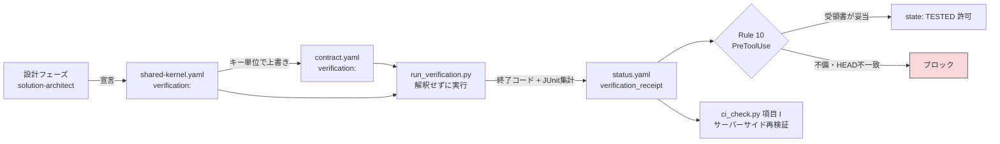

### 宣言 → 実行 → 受領書 → ゲート

規約の詳細（宣言できるキー・受領書の形・CI 側の等価条件）は
`harness/CONVENTIONS.md` 12 節を単一の情報源とします。要点だけ記すと:

1. **宣言**: `solution-architect` が技術スタックを決めるのと同じ場所で
   `verification.test_command` 等を宣言する。`test_command` は必須。
2. **実行**: `feature-builder` が実装をコミットしてから
   `python3 harness/scripts/run_verification.py --app <app-id> --feature <feature-id>` を実行する。
3. **受領書**: 結果が `status.yaml` の `verification_receipt` に記録される。
   **手書きはできない**（Rule 10 が Edit/Write によるこのブロックの変更を拒否する）。
4. **ゲート**: `state: TESTED` への書き込みは、受領書が存在し、宣言された全コマンドが
   `exit_code: 0` で、`commit` が現在の HEAD と一致する場合のみ許可される。

**`commit` の一致条件が本質です。** これが無ければ、実装を書き換えた後も過去の成功記録を
使い回して `TESTED` を宣言できてしまいます。受領書は「そのコミットの状態で通った」という
主張であり、コミットが進めば無効化されなければなりません。

### Rule 10 と Rule 8 の順序

受領書を書いた `status.yaml` を先にコミットすると HEAD が進んでしまい、`受領書の commit != HEAD`
で Rule 10 に弾かれます。かといって未コミットのまま応答を終えようとすると、今度は Rule 8
（未コミット状態での停止拒否）に止められます。したがって「実装をコミット → 検証を実行 →
（受領書ができた `status.yaml` を）**コミットせずに** `state: TESTED` を書く → 最後に 1 回で
コミット」の順序を守る必要があります。検証が失敗した場合は `state: TESTED` へは進めないため、
失敗した受領書だけをその場でコミットしてかまいません（次の修正はその上に積む）。

### JUnit XML — 非依存化の技術的な鍵

`verification.junit_xml` を宣言すると、ハーネスは XML を読むだけで**言語を知らずに**
空振り（`tests="0"` を成功と呼んでいないか）・失敗・スキップ率を判定します。
JUnit XML は pytest / jest / vitest / go-test（`go-junit-report`）/ cargo（`cargo2junit`）/
JUnit / RSpec / PHPUnit がいずれも出力できる事実上のクロススタック標準です。

宣言方式なので、**JUnit XML を出せない技術を選んだ場合は `junit_xml` を宣言しなければよい**。
その場合これらの判定だけが無効になり、終了コードによるゲートは効き続けます
（非依存性を段階的に degrade させる設計）。

### 7節の対照表に与える影響

この仕組みにより、7 節「決定論 vs AI判断 対照表」で **AI判断** に分類していた次の項目が
**決定論** 側へ移ります。

| 項目 | 根拠 |
|---|---|
| テストを実際に実行して通したか | Rule 10（受領書 + commit 一致） |
| テストが空振りしていないか | JUnit XML の `tests` / `skipped` 集計 |

一方、**テストの十分性（何をテストすべきか）そのものは依然として AI 判断**です。
「テストが実在して通った」ことと「テストが十分である」ことは別問題であり、後者は
15 節（要件トレーサビリティ）と 16 節（独立レビューア）で扱います。

---

## 15. 契約の機械検証（`interfaces` 突合・要件トレーサビリティ）

`contract.yaml` の `inputs[].json_schema` / `outputs[].json_schema` と、
`requirements.machine.yaml` の `functional_requirements[].id`（`^FR-[0-9]+$`）は、
いずれも**既にスキーマで固定された機械可読な宣言**です。JSON Schema の構造比較も ID の
照合も完全にスタック非依存なので、追加の技術選定なしに機械検証できます。

### `interfaces[]` の JSON Schema 突合（`check_interfaces.py` / CI 項目 J）

apparness は機能ごとに独立した worktree で**並行実装**することを前提にしています（8節）。
そのため「機能 A の出力」と「機能 B の入力」の食い違いは、現状 `integrator` が merge して
初めて露見します。**並行作業の規模が大きいほど手戻りが増える構造**であり、統合前に検出できる
ことの価値は apparness 自身の設計に固有のものです。

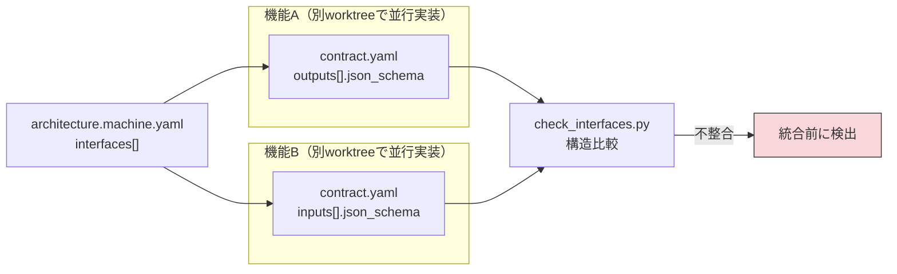

判定内容（いずれも「producer の値域 ⊆ consumer の受入範囲」という共変の向きで見る）:

| 観点 | 例 |
|---|---|
| 端点の実在 | `producer_feature` が `features[]` に無い、`producer_output` が `outputs[]` に無い |
| 型の一致 | producer が `["string","null"]` を出しうるのに consumer が `string` しか受けない |
| 必須項目の包含 | producer が出さない項目・出すとは限らない項目を consumer が `required` にしている |
| `enum` の包含 | producer が出しうる値を consumer の `enum` が受け付けない |

どちらかが制約を書いていない箇所は**判定不能として何も言いません**
（過検出でチェックが信用されなくなるほうが害が大きいため）。

実行タイミングは 3 か所です。`solution-architect` が設計中に（契約ドラフトを揃えるため）、
`integrator` が merge の前に（結線コードで辻褄を合わせてしまう前に）、そして CI の項目 J。

```
python3 harness/scripts/check_interfaces.py [--app <app-id>]
```

### 要件 → 機能 → テスト のトレーサビリティ（`check_traceability.py` / CI 項目 K）

`requirements.machine.yaml` の `functional_requirements[].id` は `^FR-[0-9]+$` で既に固定
されています。ここに `architecture.machine.yaml` の `features[].covers_requirements` と
`contract.yaml` の `test_strategy.coverage[]` を接続すると、**要件の取りこぼし**と
**受入基準に対応するテストの不在**が機械検出できるようになります。

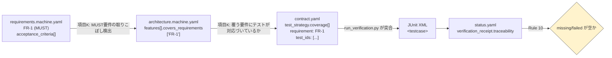

これにより「テストが実在して通った」（14節）に加えて、**「受入基準に対応するテストが実在して
通った」**ところまで機械検証できます。「実装したと主張しているが裏付けが無い」「テストで
覆われていないコードがある」といった、通常はスタック固有のカバレッジツールに頼る検査の一部を、
スタック非依存のまま得たことになります。

`test_ids` の書式はハーネスが規定しません（pytest / jest / JUnit / RSpec いずれの流儀でも、
`<testcase>` の `classname`/`name`/`file` から組み立てられる代表的な形と一致すれば通る）。

### 残る AI 判断

トレーサビリティが保証するのは「宣言された対応づけが嘘でないこと」までです。
**「その受入基準に対してそのテストが妥当か」は依然として AI（と人間）の判断**であり、
そこは 16 節の独立レビューアが扱います。

---

## 16. 独立レビューア（`gate-reviewer`）

14 節（受領書）と 15 節（トレーサビリティ）で機械化できるのは、**「テストが実在して通った」**
**「受入基準に対応づけられている」**ところまでです。「そのテストが受入基準を実際に検証して
いるか」「契約の意図から外れていないか」は、依然として判断を要します。

その判断を**実装者自身**に委ねている限り、作者バイアスが残ります（自分が書いたコードは
自分では正しく見える）。`feature-builder` が自ら `code-review` skill を呼ぶ現在の形は、
定義上**自己レビュー**です。

そこで `state: TESTED` の前に、実装者とは**別のセッション・別のコンテキスト**で動く
`gate-reviewer` subagent が審査します。これは**プロセスであってスタックではない**ため、
アプリ非依存性を損なわずに導入できます。

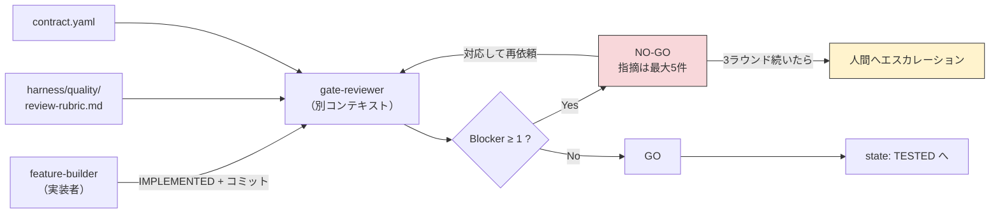

### 設計上の要点

| 要点 | なぜそうするか |
|---|---|
| 判断基準は `review-rubric.md` **だけ**。rubric 外の指摘は無効 | そうしないとレビューが「気になったことを言う場」になり、何ラウンドで終わるか誰にも分からなくなる |
| 軸は**スタック非依存のものだけ**（契約準拠・テスト十分性・セキュリティ・独立性・デザイン） | 「Python ではこう書く」はハーネス本体の関心事ではない（17節の外部スタックパックの領分） |
| verdict は深刻度の**集計から機械的に**決まる（Blocker ≥ 1 → NO-GO） | 「総合的に見て問題なさそう」で通してしまう余地を残さない |
| 1 ラウンド最大 5 件・3 ラウンドで人間へエスカレーション | 多すぎる指摘は対応されずに流される。収束しない論点は設計か要件の側に問題がある |
| レビューアに `Write`/`Edit` を**与えない** | レビューアが直せてしまうと、レビューと実装の分離という前提そのものが崩れる |

### `status.yaml` の `review` は記録であって証明ではない

審査結果は `status.yaml` の `review`（`verdict`/`rounds`/`blockers`/…）に記録しますが、
**検証受領書（14節）と違い、実行の裏付けを持ちません**。Rule 10 のような機械的ゲートには
していません（AI が書いた値を AI が検証しても意味がないため）。人間が `PROGRESS.md` を
見たときに「どのラウンドで通ったのか」を追えるようにするための記録です。

---

## 17. スタックパック（スタック固有の標準の外部化）

apparness の中身が「薄い」ように見える箇所——**技術選定の妥当性を担保する層が無い**、
言語ごとの実務知見が無い——には、**唯一の正しい対処**があります。ハーネス本体に
`tech.md` 相当を置くことではなく、**スタック固有の標準を外部プラグインとして接続できる
規約を定義する**ことです。

本体に「Python ではこう書く」と書いた瞬間、このハーネスは「どんなアプリでも作れる」もので
はなくなります。一方、知見が無ければ実装の質は上がりません。**外部化はこの 2 つを両立させる
唯一の経路**です。

### 受け口は既にある

新しい強制機構は要りません。既存の Rule 5 と Rule 6 がそのまま使えます。

```mermaid
flowchart LR
    SA["solution-architect<br/>技術スタックを決定"] -->|required_skills[] に<br/>kind: stack-pack で登録| SK["shared-kernel.yaml"]
    SK --> R5{"Rule 5<br/>src/** への最初の書き込み時"}
    R5 -->|plugin_ref が有効化されている| IMPL["実装を許可"]
    R5 -->|欠けている| BLOCK["実装をブロック<br/>インストール手順を提示"]
    SK -.->|Rule 6: feature-builder は<br/>書き換えられない| FB["feature-builder"]
    style BLOCK fill:#f8d7da,stroke:#333
```

不足していたのは「**パックが満たすべきインターフェースの定義**」だけでした。
規定すべきは*パックの形式*であって*パックの中身*ではありません。
仕様は `harness/STACK_PACK.md` にあります。

| 規定する（形式） | 規定しない（中身） |
|---|---|
| 命名（`<stack-id>-stack-pack`）、1 パック = 1 スタック | どのライブラリを推奨するか |
| 必須の記載項目 5 つ（バージョン下限とその根拠 / 禁止パターン / `verification.*_command` の推奨値 / テスト規約 / ライブラリ選定の指針） | それぞれに何を書くか |
| `harness/quality/*.md` との優先関係（ベースラインが常に優先） | パック内のルールの内容 |

### なぜ `gate-reviewer` はパックを読まないのか

レビューの軸を `review-rubric.md` だけに固定するためです（16節）。スタック固有の流儀まで
verdict の材料にすると、指摘が無限に増え、何ラウンドで終わるか誰にも分からなくなります。
**パックは実装時に `feature-builder` が従う指針であって、通過判定の基準ではありません。**

### 下限は常にハーネスが持つ

`required_skills[]` が空でも、`harness/quality/*.md`（Layer 1）と Rule 10 の検証受領書は
そのまま効きます。**スタックパックは品質の上積みであって、下限を担保するものではありません。**

---

## 18. CONVENTIONS.md から移設した設計意図・背景

`harness/CONVENTIONS.md` は**規範の単一情報源**であり、コンテキスト予算（15節・CI 項目 L）の
対象でもあります。規範そのものではない「なぜそうなっているか」の説明はここに置きます。
見出しは移設元の CONVENTIONS.md の節番号に対応します。

### 18-1. 5節（状態機械）— 前進のみを許す理由

状態遷移は基本的に前進のみを許可します。`NOT_STARTED` からいきなり `INTEGRATED` にする、
`CONTRACT_APPROVED` から `NOT_STARTED` に後退させる、といった書き込みは Rule 9 が拒否します。
後退を許すと「一度戻してからやり直す」という形で契約凍結（Rule 3）と受領書ゲート（Rule 10）を
両方すり抜けられるためです。

`BLOCKED` からの復帰時に `state_history[]` を遡るのは、**「一度 `BLOCKED` にしてから好きな状態へ
飛ぶ」という抜け穴を塞ぐ**ためです。`BLOCKED` はどの非終端状態からでも入れる「一時停止」なので、
これが無ければ `IN_PROGRESS → BLOCKED → INTEGRATED` が通ってしまいます。
`SUPERSEDED` への遷移をどこからでも許すのは、`diff-design` による置き換えがいつでも起こりうるためです。

`validate_status_transition.py` は `--status-file` に `status.yaml` を渡すと履歴も踏まえて
判定します（人間/CI 向けの手動確認 CLI）。

### 18-2. 6節（独立機能）— `$ref` を使わない理由

`check_interfaces.py` は JSON Schema の `$ref` を解決しません。参照で書くと端点の突合が効かなく
なり、**共通型に集約したつもりが機械検証を失う**という最悪の結果になります。だから共通型は
各 `contract.yaml` にインライン展開して書き、`shared-kernel.yaml` の `common_types` は
「何を共通とみなすか」の単一の情報源として人間が参照するために使います。

`interfaces[]` の突合が見るのは、端点の実在・型の一致・必須項目の包含関係（producer が出さない／
出すとは限らない項目を consumer が `required` にしていないか）・`enum` の包含関係です。
JSON Schema の構造比較はスタック非依存なので、**並行実装中の機能間の食い違いを統合前に検出できます**。
`features[]` が互いへの `depends_on` を持たないのは、「入出力さえわかれば内部を知らなくてよい」
という独立性を構造的に強制するためです。

### 18-3. 7節（Hook ルール）— 各ルールの補足

- **Rule 1**: `.github/workflows/` は CI 設定であり、これも「ハーネス本体」の一部として保護します。
  `.claude/settings.local.json` を対象外にするのは、gitignore 対象でチームに共有されないためです。
  Skill を自分の環境でだけ使うなら `/plugin install <name> --scope local`。`--scope project` は
  `.claude/settings.json` を書き換え、CONVENTIONS.md 10節 Layer 2 の前提を壊します。
- **Rule 3**: `CONTRACT_APPROVED` への遷移時に `approved_by`/`approved_at` を要求するのは、
  **凍結の根拠を機械的に確かめる**ためです。凍結後の `open_issues[]` 追記のみを許すのは、
  契約の同一性を保ったまま申し送りを機械検証の対象に残せるようにするためです。
- **Rule 5**: 設計で使うと決めた Skill を欠いたまま実装が進むことを防ぎます。
- **Rule 6**: 実装中に変更が必要だと気づいたら、実装を止めて `diff-design` skill での再設計に
  回してください。メインの worktree からの `solution-architect`/`diff-design` の書き込みには
  適用されません。
- **Rule 7**: 要件が変更されたのに設計が追従していない状態で承認させないための規則です。
  `status` だけ先に APPROVED にした中間状態を塞ぐために、同じ書き込みで
  `approved_by`/`approved_at` を要求します。
- **Rule 8**: 新規追加ファイルもコミット漏れの対象に含めます（`--untracked-files=all`）。
- **Rule 10**: `verification_receipt` の手書きを拒否するのは、受領書が `run_verification.py` の
  **実行の記録**だからです。手書きできてしまえば「実行した」という主張の裏付けになりません。
- **Rule 11**: CI 項目 J（契約同士の静的比較）をすり抜ける実装差異を、実行結果で塞ぎます。

**worktree の読み替えが要る理由**: 読み替えないと `^apps/.../03-features/...` にアンカーされた
Rule 1・2・3・5・9・10 がまとめて素通りします（経緯と実証は 5節）。書き込み先をその所属リポジトリの
ルート基準で相対化するのは、worktree が隔離機構ではなく、**隔離しているのは Hook だから**です（8節）。

**Bash 検知が 2 段構えである理由**: 静的検知（`extract_bash_candidate_paths`）は未然に止めますが、
変数展開されたパス等の検知漏れが原理的に残ります。事後検証（`post_tool_use_guard.py`）が実行前後の
スナップショットを内容のハッシュで比較して確実に捕まえ、違反は実行直前の内容へ巻き戻します。
静的検知は「止められるものは実行前に止める」ために削除しません。ハーネス自身のスクリプト経由の
書き込み（`run_verification.py` 等）は、コマンド文字列にパスが現れないため静的検知には掛かりません。

**バイパス用の環境変数を用意しない理由**: ブロックされた際に AI 自身が環境変数を設定して解除
できてしまうと、決定論的強制という目的そのものが崩れるためです。

### 18-4. 9節（自動化の度合い）— 機械強制の限界

要件定義の承認だけは常に人間必須なのは、**アプリの目的そのものを AI だけで確定させない**ための
ハーネス全体の固定ポリシーです。

「本当に人間が承認したか」という意味論的な判定を Hook が完全に決定論的に強制することはできません
（Hook が見られるのはファイルパスと内容だけで、対話の意味までは判定できないため）。だから機械的に
強制できる範囲を 2 点に限定しています。過信せず、`PROGRESS.md` の `autonomy_mode` 表示で人間が
随時状況を確認できることを最終的な担保としてください。

承認の書き込みを親セッションが行うのは、**subagent にはユーザーの承認が親エージェントからの伝聞と
してしか届かず、人間が承認したことを確かめようがない**ためです。

### 18-5. 10節（品質保証）— Layer 2 に「完全オプション」を置かない理由

技術スタックは設計フェーズで確定させ、それに反した実装を許さない、という原則をプラグイン系 Skill
にも適用します。「あれば使う、無ければ黙ってスキップ」という完全オプションの層を置くと、
**その Skill があるかどうかで品質が変わり、しかもそれが記録に残りません**。
Layer 1（`harness/quality/*.md`）を CONVENTIONS.md 本体に埋め込まないのは、該当フェーズで初めて
Read されるようにして、コンテキストを必要なときだけ消費するためです。
`required_skills[]` の選定手順は `solution-architect` が持ちます。
`gate-reviewer` の軸がすべてスタック非依存なのは、スタック固有の標準が外部スタックパック（17節）の
領分だからです。

### 18-6. 11節（上位文書優先）

`shared-kernel.yaml` と `architecture.machine.yaml` を反復作業として扱うのは、機能一覧が固まって
初めて共通部分が見えてくることが多いためです（手順は `solution-architect` のプロンプト）。
Rule 7 の版一致条件は「要件は変わったのに設計が追従していない」状態のまま先に進むことを構造的に防ぎます。

### 18-7. 12節（検証コマンド）

ハーネスは**規定 prescribe をしない。要求 require と実行 execute だけを行う**。これによりアプリ
非依存性を保ったまま実行ベースの検証が成立します。`test_command` を宣言するのは
`solution-architect` の責務です（技術スタックを決めるのと同じ場所で検証手順も決める）。

`run_verification.py` は検証コマンドの生成物を検出したら警告します（何が生成物かはスタックごとに
違うため、ハーネスは判定せず報告だけする）。検証が失敗した受領書もコミットして構いません
（`TESTED` への昇格は Rule 10 が別途止めます）。JUnit XML を出力できない技術なら宣言しなければよく、
終了コードによるゲートはそのまま効き続けます。

### 18-8. 15節（コンテキスト予算）

上限は「ここまでなら使ってよい」という許可ではなく、**超えるときに意識的な判断を強制する**ための
線です。上限の数値を上げるのは、移せるものを移し切ってからにしてください。

agent プロンプト本文中の「7節 Rule 7」のような出典の注記は、読みに行けという指示ではなく、
**規約を保守する人間がたどるための手がかり**です。だからマーカーが `none` の agent でも書けます。

規範を `CONVENTIONS.md` だけに置くのは、違反すれば Hook が止め、そのエラーメッセージが直し方を
示すからです。二重管理の実例は F-048（`DOGFOODING-LOG.md`）。
