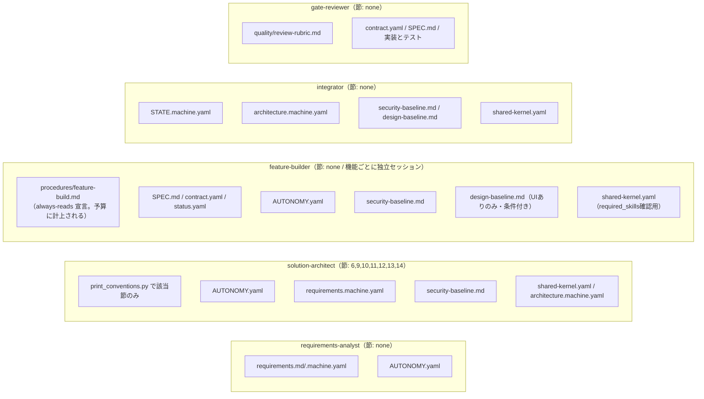

# apparness ハーネス 設計意図・背景（保守者向け）

> **人間向けの文書です（ハーネスを保守する人向け）。** AI はこの文書を読みません（Rule 13）。
> 配布元リポジトリにだけあり、インストーラで導入先へはコピーされません。

`harness/CONVENTIONS.md` は規範だけを持ちます。「なぜそうなっているのか」「どんな事故から
その規則が生まれたのか」「既知の制約をいつ見直すのか」はこの文書に置きます。
しくみの説明（利用者向け）は `harness/docs/GUIDE.md`、改修の手順は [DEVELOPMENT.md](DEVELOPMENT.md) です。

## 目次

1. [コンテキスト消費マップと予算](#1-コンテキスト消費マップと予算)
2. [Hook ルールの経緯と実証](#2-hook-ルールの経緯と実証)
3. [CI の設計判断](#3-ci-の設計判断)
4. [脆弱性スキャンの設計判断](#4-脆弱性スキャンの設計判断)
5. [検証受領書の設計判断](#5-検証受領書の設計判断)
6. [独立レビューアの設計上の要点](#6-独立レビューアの設計上の要点)
7. [スタックパックの設計判断](#7-スタックパックの設計判断)
8. [CONVENTIONS.md の各節の設計意図](#8-conventionsmd-の各節の設計意図)
9. [既知の制約と再検討の条件](#9-既知の制約と再検討の条件)
10. [人間向け文書と AI 向け文書の分離](#10-人間向け文書と-ai-向け文書の分離)


---

## 1. コンテキスト消費マップと予算

各エージェント・スキルが「常時（起動時に必ず）」読むファイルと「条件付き」で読むファイルを分けています。**この量は設計制約として扱い、CI が機械的に上限を強制します**（後述「コンテキスト予算」）。

**`harness/CONVENTIONS.md` を全文読む subagent はいません。** 各 agent は自分のフェーズに要る節だけを
プロンプト冒頭のマーカーで宣言し、`print_conventions.py` で読み込みます。実際に宣言している
agent は `solution-architect` の 1 つだけで（6,9,10,11,12,13,14 節）、残りの 4 つは `none` です
——担当範囲に必要な規約はプロンプト本文に書き切ってあるためです。宣言が `none` の agent でも、
本文中に「7節 Rule 7」のような**出典の注記**は書きます。



| Subagent / Skill | 読む `CONVENTIONS.md` の節 | 常時読むその他のファイル | 条件付きで読むファイル |
|---|---|---|---|
| `requirements-analyst` | なし | `requirements.md`, `requirements.machine.yaml`, `AUTONOMY.yaml` | なし |
| `solution-architect` | 6,9,10,11,12,13,14 | `AUTONOMY.yaml`, `requirements.machine.yaml`, `security-baseline.md` | WebSearch結果（ライブラリ調査時） |
| `feature-builder` | なし | `harness/procedures/feature-build.md`（always-reads）, `SPEC.md`, `contract.yaml`, `status.yaml`, `AUTONOMY.yaml`, `security-baseline.md`, `shared-kernel.yaml` | `design-baseline.md`（UIを持つ機能のみ） |
| `integrator` | なし | `STATE.machine.yaml`, `architecture.machine.yaml`, `security-baseline.md`, `shared-kernel.yaml` | `design-baseline.md`（UIありのみ） |
| `gate-reviewer` | なし | `harness/quality/review-rubric.md`, `contract.yaml`, `SPEC.md`, 実装とテスト | なし |
| `init-app` skill | なし（9節の内容を要約して保持） | `AUTONOMY.yaml` | なし |
| `new-feature-worktree` skill | なし | `architecture.machine.yaml`（features[]確認のみ） | なし |
| `diff-design` skill | 11（必要なときだけ `print_conventions.py --sections 11`） | 旧新の `requirements`/`architecture` | 旧バージョン（`history/`） |

**設計上の意図**: `harness/quality/*.md`（品質ベースライン）・`harness/STACK_PACK.md`・`harness/CLAIMS.md` は `CONVENTIONS.md` に内容を埋め込まず、該当フェーズ・該当条件でのみ `Read` される別ファイルにしています。これにより、品質基準を使わないフェーズ（例: `requirements-analyst`）では一切コンテキストを消費しません。

### コンテキスト予算（CI 項目 L）

「常時読み込み量を意識する」は、意識だけでは守れません。`ci_check.py` の項目 L が
機械的に上限を強制します（単一の情報源は `CONVENTIONS.md` 15節）。

| 対象 | 上限 | 実測（2026-08-24） |
|---|---|---|
| `harness/CONVENTIONS.md` | 36,000 バイト | 31,975（残り 4,025） |
| `.claude/agents/*.md` 各ファイル | 12,000 バイト | 最大は `solution-architect.md` の 11,352（残り **648**） |
| 1 セッションの常時コスト＝ agent プロンプト ＋ **読むと宣言した `CONVENTIONS.md` の節** ＋ **起動直後に読むと宣言した手順書** | 46,000 バイト | 最大は `solution-architect` の 24,999（残り 21,001） |

3 行目が `CONVENTIONS.md` 全文ではなく「**読むと宣言した節**」なのは、全文を読む agent がいないためです
（`attributed_conventions_bytes`）。

上限は「ここまで使ってよい」という許可ではなく、**超えるときに意識的な判断を強制する**ための線です。
上限に当たったら、まず説明・背景・設計意図をこの文書へ移します
（`CONVENTIONS.md` に残すのは「機械と保守者が従うべき規約そのもの」だけでよい）。

**予算の対象外になるのは「条件が揃ったときにだけ読まれる文書」だけです**
（`harness/quality/*.md`・`harness/STACK_PACK.md`・`harness/CLAIMS.md`）。
**`harness/procedures/*.md` は対象外ではありません。** ここは「その agent が起動直後に読む手順」の
置き場所で、読まれるコストは常時コストと同じです。プロンプト本文を別ファイルへ移して
「これを読め」と書いても、セッションに載るバイト数は減りません（導入文のぶん増えます）。
測定値だけが良くなって実態が悪化することを防ぐため、次のマーカーでの宣言を義務づけ、
項目 L がその実サイズを合計に計上します。宣言せずに `harness/procedures/*.md` を読ませていたら不合格です。

```
<!-- context-budget: conventions-sections=6,9,13 -->
<!-- context-budget: always-reads=harness/procedures/feature-build.md -->
```


---

## 2. Hook ルールの経緯と実証

### worktree を通るパスの読み替えが要った理由（F-029/F-030）

**判定対象のパスは、`.worktrees/` を通る場合その worktree を基準に読み替えてから Rule に掛けます**
（`path_utils.resolve_worktree_scope`）。`harness/docs/GUIDE.md` 7節のとおり worktree の実体は
`apps/<app>/.worktrees/<feature-id>/` にあり、その中に同じ `apps/<app>/03-features/<feature-id>/`
という相対パスが再び現れます。メインの worktree から見た相対パスは接頭辞ぶんだけ深くなるため、
読み替えをしないと `^apps/.../03-features/...` にアンカーされた Rule 1・2・3・5・9・10 が
まとめて素通りします。ドッグフーディングで実証したもので、メインセッションから**受領書なしで
`state: TESTED` を書き込めていました**（`docs/maintenance/DOGFOODING-LOG.md` F-029/F-030）。しかも `.worktrees/` は
メインリポジトリの `.gitignore` 対象なので `git status` に現れず、事後検証による巻き戻しも
働きませんでした——静的検知と事後検証の二段構えが、どちらもこの経路では機能していなかったことになります。
読み替えにより、どのセッションから書いても同じ Rule が同じ意味で効きます。worktree の中から
書いている場合は接頭辞が現れないため、読み替えは恒等写像です。

### 結果を再現できない書き込み手段を拒否する理由（F-021）

`sed -i` で `state: TESTED` にすると、内容比較で判定するゲート（Rule 3・7・9・10・11）が一度も
走らないまま通ってしまったのが実地の失敗です（`docs/maintenance/DOGFOODING-LOG.md` F-021）。
「Bash では判定できないから素通りさせる」のではなく、手段そのものを拒否することでその穴を塞ぎました。
判定基準を「どのツールか」ではなく「`path_utils.simulate_write_result` が結果を再現できるか」に
しているので、将来ツールが増えても既定で拒否側に入ります。

### worktree は隔離機構ではない（F-055）

**git worktree にアクセス制限の機能は無い。** ただのディレクトリであり、そこで動くプロセスは
OS の権限が許す限りどこでも読めるし書ける。`../../../..` でメインリポジトリに到達できる。

隔離を成立させているのは Hook である。worktree が果たしている役割は「壁」ではなく
**「身分証」**——Rule 2 は worktree ルートの basename を見て「このセッションは誰の担当か」を
判定している。

この前提が抜けていたため、実際に穴が開いていた。Hook は書き込み先を**セッションの worktree
ルートからの相対パス**に直してから `^harness/`・`^apps/.../03-features/...` に掛けていたので、
外を指すパスは `../../../../harness/CONVENTIONS.md` のような形になり**どの Rule にもマッチせず
素通りした**。事後検証もセッションの worktree の `git status` しか見ないため拾えなかった。

現在は `path_utils.resolve_write_target` が、書き込み先を**それが属するリポジトリのルート**を
基準に相対化してから Rule に掛ける。Rule 6 だけは「feature 用 worktree からの書き込みか」を
判定する必要があるため、書き込み先ではなく**セッションの cwd** で判定する。
リポジトリの外（`/tmp` 等）は対象外のまま——過剰にブロックしないため。

なお「他機能の内部を知らずに実装できる」という独立性のほうは、Hook ではなく**ブランチ**が
担保している。各機能の実装はそれぞれの feature ブランチにあり、他機能の worktree には
**そもそも存在しない**（`todo-markdown` の worktree に見える機能は `todo-markdown` だけ）。
読もうにも無い、という構造なので、AI の自制には依存していない。

### Bash 検知の 2 段構え（詳細）

1. **静的検知（未然防止）**: `shlex` でクォート・行継続・ヒアドキュメントを考慮して
   コマンド文字列から書き込み先を割り出す（`path_utils.extract_bash_candidate_paths`）。
   **変数展開されたパス等の検知漏れは原理的に残る**。
2. **事後検証（確実な検知）**: `post_tool_use_guard.py`（PostToolUse）が、Bash 実行前に保存した
   スナップショットと実行後を比較し、**内容が実際に変わったパス**だけを Rule 1・2・3・5・6 で
   判定する。比較は `git status` の状態コードではなく**内容のハッシュ**で行う——`git add` は
   内容を変えないのに状態コードを変えるため、コードで比較すると誤発火し、正当な編集を
   巻き戻してしまう（F-050 で実際に `open_issues[]` の追記が消えた）。逆に、実行前から dirty な
   ファイルをさらに書き換えてもコードは変わらないため、内容比較でなければ取りこぼす。
   違反があれば**実行直前の内容へ**巻き戻して報告する（exit 2）。HEAD へ戻さないのは、
   実行前からの未コミット変更（人間の編集など）を巻き添えにしないため。
   スナップショットが取れなければ何もしない（安全側）。

**静的検知は削除しない。** 未然に止めるほうが AI にとって学習可能なフィードバックになるためで、
事後検証は最後の砦という位置づけ。代償として Bash ごとに `git status` が 2 回走る。

---

## 3. CI の設計判断

### なぜ「アプリの技術スタックに依存しない範囲」に限定するか

このハーネスは「どんなアプリでも作れる」ことを前提にしており、導入時点でアプリの中身は空です。
feature-builder/integrator が書く単体・結合テスト（npm test / pytest / go test 等、アプリごとに異なる）を
実行する仕組みはハーネス側に汎用的に組み込めません。そのため、**アプリのスタックを問わずに再検証できるもの**
（YAML/JSON Schema・Hookのルール群・進捗ファイルの鮮度）に絞っています。

### B を main で判定しない理由の実例

このワークフローを初めて `main` へ push した際に、それまでの正当な作業がすべて
「`main` で harness/ を直接変更した」と誤検知される問題が起きました。

### 判定ロジックの実体はHookと共有

`ci_check.py` は `harness/hooks/lib/path_utils.py` の `validate_status_transition`・
`extract_scalar_field`・`read_state_field` をそのまま import して使う（`hooks/` は依存ゼロの
ため、`scripts/` 側から import しても安全。逆方向——`hooks/` が `scripts/_common.py` 等の
PyYAML依存コードを import すること——は禁止のまま）。これにより、ローカルのHookとCIの
判定基準がズレることを防いでいる。

---

## 4. 脆弱性スキャンの設計判断

### なぜ npm audit / pip-audit を個別に統合しないか

このハーネスは「どんなアプリでも作れる」ことを前提にしており、`solution-architect` が
どの言語・パッケージマネージャを選ぶかは設計フェーズで初めて決まる（3節で述べた
「導入時点でアプリの中身は空」という制約と同根）。`npm audit`・`pip-audit` はそれぞれ
npm・pip というエコシステム固有の CLI であり、対応エコシステムを増やすたびにハーネス側の
出し分けロジックが増える。OSV-Scanner はディレクトリを再帰的に走査して見つかった lockfile
（`package-lock.json`・`requirements.txt`・`poetry.lock`・`Cargo.lock`・`go.sum` 等）の
種類を自動判別し、OSV データベースに一括照会する単一のツールであり、ハーネス側がエコシステムを
列挙する必要がない。初期のロードマップ（このリポジトリには残っていない）では
「npm audit/pip-audit/OSV等」を候補として挙げていたが、
検討の結果 v1 では OSV-Scanner 一本を採用した。

### なぜ Hook ではなく CI に置くか

`harness/hooks/*.py` は「依存ゼロの標準ライブラリのみ」（`CONVENTIONS.md` 1節）で、ツール呼び出しのたびに
毎回起動される決定論レイヤーである。OSV-Scanner は外部バイナリであり、既定では OSV.dev への
問い合わせにネットワークアクセスを要する。これを `PreToolUse` Hook に組み込むと、Edit/Write
のたびにネットワーク越しの脆弱性DB照会が走ることになり、「低コストで毎回確実に効く」という
Hook 層の前提そのものを壊す。そのため 3節と同じ判断で、CI 側にのみ置く。

---

## 5. 検証受領書の設計判断

### なぜ非依存性を損なわないのか — 規定 / 要求 / 実行 の区別

非依存性を破るのは **規定** だけです。**要求** と **実行** はスタックを知らないまま成立します。

| 動作 | 例 | アプリ非依存性 |
|---|---|---|
| **規定** prescribe | 「backend は FastAPI を使う」 | 違反（ハーネス本体には書かない） |
| **要求** require | 「テストコマンドを機械可読な形で宣言せよ」 | 維持 |
| **実行** execute | 宣言されたコマンドを解釈せずに起動し、終了コードのみで判定する | 維持 |

ハーネスは「どのコマンドを走らせるか」を知る必要がなく、「走らせたこと」と「通ったこと」を
強制すればよい——これが以前「範囲外」としていた実行ベース検証を、非依存のまま取り込める理由です。
このパターンは `feature-contract.schema.json` の `tech_stack`（言語・ライブラリを**宣言させ**、
中身を**規定しない**）で既に採用しているものと同じです。


### 対照表（`harness/docs/GUIDE.md` 6節）に与える影響

この仕組みにより、`harness/docs/GUIDE.md` 6 節「決定論 vs AI判断 対照表」で **AI判断** に分類していた次の項目が
**決定論** 側へ移ります。

| 項目 | 根拠 |
|---|---|
| テストを実際に実行して通したか | Rule 10（受領書 + commit 一致） |
| テストが空振りしていないか | JUnit XML の `tests` / `skipped` 集計 |

一方、**テストの十分性（何をテストすべきか）そのものは依然として AI 判断**です。
「テストが実在して通った」ことと「テストが十分である」ことは別問題であり、後者は
`harness/docs/GUIDE.md` の 13 節（要件トレーサビリティ）と 14 節（独立レビューア）で扱います。

---

## 6. 独立レビューアの設計上の要点

### 設計上の要点

| 要点 | なぜそうするか |
|---|---|
| 判断基準は `review-rubric.md` **だけ**。rubric 外の指摘は無効 | そうしないとレビューが「気になったことを言う場」になり、何ラウンドで終わるか誰にも分からなくなる |
| 軸は**スタック非依存のものだけ**（契約準拠・テスト十分性・セキュリティ・独立性・デザイン） | 「Python ではこう書く」はハーネス本体の関心事ではない（7節の外部スタックパックの領分） |
| verdict は深刻度の**集計から機械的に**決まる（Blocker ≥ 1 → NO-GO） | 「総合的に見て問題なさそう」で通してしまう余地を残さない |
| 1 ラウンド最大 5 件・3 ラウンドで人間へエスカレーション | 多すぎる指摘は対応されずに流される。収束しない論点は設計か要件の側に問題がある |
| レビューアに `Write`/`Edit` を**与えない** | レビューアが直せてしまうと、レビューと実装の分離という前提そのものが崩れる |

---

## 7. スタックパックの設計判断

apparness の中身が「薄い」ように見える箇所——**技術選定の妥当性を担保する層が無い**、
言語ごとの実務知見が無い——には、**唯一の正しい対処**があります。ハーネス本体に
`tech.md` 相当を置くことではなく、**スタック固有の標準を外部プラグインとして接続できる
規約を定義する**ことです。

本体に「Python ではこう書く」と書いた瞬間、このハーネスは「どんなアプリでも作れる」もので
はなくなります。一方、知見が無ければ実装の質は上がりません。**外部化はこの 2 つを両立させる
唯一の経路**です。

### なぜ `gate-reviewer` はパックを読まないのか

レビューの軸を `review-rubric.md` だけに固定するためです（6節）。スタック固有の流儀まで
verdict の材料にすると、指摘が無限に増え、何ラウンドで終わるか誰にも分からなくなります。
**パックは実装時に `feature-builder` が従う指針であって、通過判定の基準ではありません。**

---

## 8. CONVENTIONS.md の各節の設計意図

`harness/CONVENTIONS.md` は**規範の単一情報源**であり、コンテキスト予算（15節・CI 項目 L）の
対象でもあります。規範そのものではない「なぜそうなっているか」の説明はここに置きます。
見出しは移設元の CONVENTIONS.md の節番号に対応します。

### 8-1. 5節（状態機械）— 前進のみを許す理由

状態遷移は基本的に前進のみを許可します。`NOT_STARTED` からいきなり `INTEGRATED` にする、
`CONTRACT_APPROVED` から `NOT_STARTED` に後退させる、といった書き込みは Rule 9 が拒否します。
後退を許すと「一度戻してからやり直す」という形で契約凍結（Rule 3）と受領書ゲート（Rule 10）を
両方すり抜けられるためです。

`BLOCKED` からの復帰時に `state_history[]` を遡るのは、**「一度 `BLOCKED` にしてから好きな状態へ
飛ぶ」という抜け穴を塞ぐ**ためです。`BLOCKED` はどの非終端状態からでも入れる「一時停止」なので、
これが無ければ `IN_PROGRESS → BLOCKED → INTEGRATED` が通ってしまいます。
`SUPERSEDED` への遷移をどこからでも許すのは、`diff-design` による置き換えがいつでも起こりうるためです。

`validate_status_transition.py` は `--status-file` に `status.yaml` を渡すと履歴も踏まえて
判定します（人間/CI 向けの手動確認 CLI）。

### 8-2. 6節（独立機能）— `$ref` を使わない理由

`check_interfaces.py` は JSON Schema の `$ref` を解決しません。参照で書くと端点の突合が効かなく
なり、**共通型に集約したつもりが機械検証を失う**という最悪の結果になります。だから共通型は
各 `contract.yaml` にインライン展開して書き、`shared-kernel.yaml` の `common_types` は
「何を共通とみなすか」の単一の情報源として人間が参照するために使います。

`interfaces[]` の突合が見るのは、端点の実在・型の一致・必須項目の包含関係（producer が出さない／
出すとは限らない項目を consumer が `required` にしていないか）・`enum` の包含関係です。
JSON Schema の構造比較はスタック非依存なので、**並行実装中の機能間の食い違いを統合前に検出できます**。
`features[]` が互いへの `depends_on` を持たないのは、「入出力さえわかれば内部を知らなくてよい」
という独立性を構造的に強制するためです。

### 8-3. 7節（Hook ルール）— 各ルールの補足

- **Rule 1**: `.github/workflows/` は CI 設定であり、これも「ハーネス本体」の一部として保護します。
  `.claude/settings.local.json` を対象外にするのは、gitignore 対象でチームに共有されないためです。
  Skill を自分の環境でだけ使うなら `/plugin install <name> --scope local`。`--scope project` は
  `.claude/settings.json` を書き換え、CONVENTIONS.md 10節 Layer 2 の前提を壊します。
- **Rule 3**: `CONTRACT_APPROVED` への遷移時に `approved_by`/`approved_at` を要求するのは、
  **凍結の根拠を機械的に確かめる**ためです。凍結後の `open_issues[]` 追記のみを許すのは、
  契約の同一性を保ったまま申し送りを機械検証の対象に残せるようにするためです。
- **Rule 5**: 設計で使うと決めた Skill を欠いたまま実装が進むことを防ぎます。
- **Rule 6**: 実装中に変更が必要だと気づいたら、実装を止めて `diff-design` skill での再設計に
  回してください。メインの worktree からの `solution-architect`/`diff-design` の書き込みには
  適用されません。
- **Rule 7**: 要件が変更されたのに設計が追従していない状態で承認させないための規則です。
  `status` だけ先に APPROVED にした中間状態を塞ぐために、同じ書き込みで
  `approved_by`/`approved_at` を要求します。
- **Rule 8**: 新規追加ファイルもコミット漏れの対象に含めます（`--untracked-files=all`）。
- **Rule 10**: `verification_receipt` の手書きを拒否するのは、受領書が `run_verification.py` の
  **実行の記録**だからです。手書きできてしまえば「実行した」という主張の裏付けになりません。
- **Rule 11**: CI 項目 J（契約同士の静的比較）をすり抜ける実装差異を、実行結果で塞ぎます。
- **Rule 12（危険操作フロア）**: Rule 1〜11 はすべて**工程の整合性**を守るもので、危険操作を
  止める規則は 1 件もありませんでした。AUTONOMOUS モードで長時間走らせる前提のハーネスとして、
  これが実運用上いちばん重い穴でした。設計上の要点は 3 つです。
  1. **確認（ask）ではなく拒否（deny）にする。** AUTONOMOUS では AI 自身が確認に答えて
     しまうため、確認は歯止めになりません。人間の判断を挟みたい操作は、拒否したうえで
     「人間が別途手で実行する」という運用に倒します。
  2. **他の Rule と独立に判定し、deny が勝つ。** Rule 12 は「このパスに書いてよいか」ではなく
     「この操作自体をやらせない」という別軸なので、書き込み先ごとのループではなく
     ツール呼び出しごとに 1 回だけ判定します。
  3. **バイパス用の環境変数を用意しない。** 誤検知は検知ロジック自体を直します。
  検知は既存の Bash トークナイザ（`iter_bash_segments`）を再利用します。パース系を 2 つ持つと、
  片方だけ直して検知が食い違うためです。D-1（再帰削除）は「リポジトリ配下に留まると確認できない」
  ものを綴りだけで拒否します——`..`・未展開の変数・`/`・`.`・先頭ワイルドカードは、解決を
  試みるまでもなく安全とは言えません。残余（変数展開・エイリアス・自作スクリプト経由の間接実行）は
  `harness/CLAIMS.md` に明記してあります。

**強制レイヤ自身が壊れたとき何が起きるか（fail-open の可視化）**

Hook は `exit 2` で拒否、それ以外は「判断なし＝通過」として扱われます。つまり `python3` が
見つからない・`import` に失敗する・タイムアウトする・例外が出る、のいずれでも Hook は
exit != 2 で終わり、**全ルールが黙って無効化された状態で作業が続きます**。決定論的強制を
掲げるハーネスにとって、これは「効いていないのに効いているつもり」という最悪の失敗の形です。

Hook を起動するのは Claude Code なので、ハーネス側からその失敗を止めることはできません。
できるのは 2 つです。

1. **判定できたのに例外で落ちた場合は、通さずに止める**（fail-closed）。
   `pre_tool_use_guard.py` の入口は `_fail_closed_main` で包み、想定外の例外を握りつぶさず
   exit 2 ＋ 理由で返します。
2. **壊れていることを人間に見せる**。`SessionStart` フック
   （`session_start_healthcheck.py`）が起動時に hooks の import 可否・`path_utils` の主要関数・
   `.claude/settings.json` の Hook 登録を検査し、異常があれば stderr の警告と
   `additionalContext` の注入で知らせます。同じ診断結果が `PROGRESS.md` の先頭にも出ます
   （9節が言う「人間が随時状況を確認できることを最終的な担保とする」の実体）。

`PROGRESS.md` に出す診断からは **Python のバージョンなど実行環境に依存する判定を外して**
あります。`PROGRESS.md` はコミットされる成果物で、CI の項目 G が「再生成した結果と一致するか」を
見るため、環境ごとに差分が出る値を混ぜると構造的に不合格になるからです。

**worktree の読み替えが要る理由**: 読み替えないと `^apps/.../03-features/...` にアンカーされた
Rule 1・2・3・5・9・10 がまとめて素通りします（経緯と実証は 2節）。書き込み先をその所属リポジトリの
ルート基準で相対化するのは、worktree が隔離機構ではなく、**隔離しているのは Hook だから**です（2節）。

**Bash 検知が 2 段構えである理由**: 静的検知（`extract_bash_candidate_paths`）は未然に止めますが、
変数展開されたパス等の検知漏れが原理的に残ります。事後検証（`post_tool_use_guard.py`）が実行前後の
スナップショットを内容のハッシュで比較して確実に捕まえ、違反は実行直前の内容へ巻き戻します。
静的検知は「止められるものは実行前に止める」ために削除しません。ハーネス自身のスクリプト経由の
書き込み（`run_verification.py` 等）は、コマンド文字列にパスが現れないため静的検知には掛かりません。

**バイパス用の環境変数を用意しない理由**: ブロックされた際に AI 自身が環境変数を設定して解除
できてしまうと、決定論的強制という目的そのものが崩れるためです。

### 8-4. 9節（自動化の度合い）— 機械強制の限界

要件定義の承認だけは常に人間必須なのは、**アプリの目的そのものを AI だけで確定させない**ための
ハーネス全体の固定ポリシーです。

「本当に人間が承認したか」という意味論的な判定を Hook が完全に決定論的に強制することはできません
（Hook が見られるのはファイルパスと内容だけで、対話の意味までは判定できないため）。だから機械的に
強制できる範囲を 2 点に限定しています。過信せず、`PROGRESS.md` の `autonomy_mode` 表示で人間が
随時状況を確認できることを最終的な担保としてください。

承認の書き込みを親セッションが行うのは、**subagent にはユーザーの承認が親エージェントからの伝聞と
してしか届かず、人間が承認したことを確かめようがない**ためです。

### 8-5. 10節（品質保証）— Layer 2 に「完全オプション」を置かない理由

技術スタックは設計フェーズで確定させ、それに反した実装を許さない、という原則をプラグイン系 Skill
にも適用します。「あれば使う、無ければ黙ってスキップ」という完全オプションの層を置くと、
**その Skill があるかどうかで品質が変わり、しかもそれが記録に残りません**。
Layer 1（`harness/quality/*.md`）を CONVENTIONS.md 本体に埋め込まないのは、該当フェーズで初めて
Read されるようにして、コンテキストを必要なときだけ消費するためです。
`required_skills[]` の選定手順は `solution-architect` が持ちます。
`gate-reviewer` の軸がすべてスタック非依存なのは、スタック固有の標準が外部スタックパック（7節）の
領分だからです。

### 8-6. 11節（上位文書優先）

`shared-kernel.yaml` と `architecture.machine.yaml` を反復作業として扱うのは、機能一覧が固まって
初めて共通部分が見えてくることが多いためです（手順は `solution-architect` のプロンプト）。
Rule 7 の版一致条件は「要件は変わったのに設計が追従していない」状態のまま先に進むことを構造的に防ぎます。

### 8-7. 12節（検証コマンド）

ハーネスは**規定 prescribe をしない。要求 require と実行 execute だけを行う**。これによりアプリ
非依存性を保ったまま実行ベースの検証が成立します。`test_command` を宣言するのは
`solution-architect` の責務です（技術スタックを決めるのと同じ場所で検証手順も決める）。

`run_verification.py` は検証コマンドの生成物を検出したら警告します（何が生成物かはスタックごとに
違うため、ハーネスは判定せず報告だけする）。検証が失敗した受領書もコミットして構いません
（`TESTED` への昇格は Rule 10 が別途止めます）。JUnit XML を出力できない技術なら宣言しなければよく、
終了コードによるゲートはそのまま効き続けます。

### 8-8. 15節（コンテキスト予算）

上限は「ここまでなら使ってよい」という許可ではなく、**超えるときに意識的な判断を強制する**ための
線です。上限の数値を上げるのは、移せるものを移し切ってからにしてください。

agent プロンプト本文中の「7節 Rule 7」のような出典の注記は、読みに行けという指示ではなく、
**規約を保守する人間がたどるための手がかり**です。だからマーカーが `none` の agent でも書けます。

規範を `CONVENTIONS.md` だけに置くのは、違反すれば Hook が止め、そのエラーメッセージが直し方を
示すからです。二重管理の実例は F-048（`docs/maintenance/DOGFOODING-LOG.md`）。

---

## 9. 既知の制約と再検討の条件

**記録の形式**: 既知の制約は次の 4 点セットで書きます。とくに **「再検討の条件」を全項目に必ず
書く**——書けないものは、なぜ書けないかを書きます。条件が書かれていない制約は、
「仕方がないもの」として永久に固定されてしまい、状況が変わっても誰も見直さないためです。

| 項目 | 何を書くか |
|---|---|
| 症状 | 利用者から見て何が起きるか（内部実装ではなく観測できる事象） |
| 根本原因 | なぜそうなるか。「難しいから」ではなく構造的な理由 |
| 適用中の緩和策 | いま何で埋めているか。埋めていないなら「なし」と書く |
| 再検討の条件 | **何が起きたら見直すか。** 期限ではなく観測可能な事象で書く |

制約は 2 つに分けます。**A（ハーネスの制御外に根本原因がある）** はハーネス側の努力では
消せないもの、**B（apparness 側で直せる）** は本来なら直せるもので、**B は改修計画の
`tasks[]` に昇格させます**（`docs/plans/IMPROVEMENT-PLAN.machine.yaml`）。

### A. ハーネスの制御外に根本原因があるもの

#### A-1. Hook の起動そのものが失敗したとき、ハーネスからは止められない

- **症状**: `python3` が見つからない・タイムアウトする等で Hook が `exit != 2` で終わると、
  Claude Code はそれを「判断なし＝通過」として扱い、Rule 1〜12 が黙って無効化された状態で
  作業が続く。
- **根本原因**: Hook を起動するのは Claude Code であり、ハーネスはその失敗を検知する側に
  立てない（失敗したら自分も動いていない）。
- **適用中の緩和策**: (1) ブロックする hook（`pre_tool_use_guard.py` / `stop_commit_guard.py`）を
  fail-closed 化し、判定に到達できたのに例外で落ちた場合**および入力そのものを解釈できない場合**
  （内容があるのに JSON として読めない／構造化編集なのに書き込み先が無い）は通さず `exit 2` に
  する。空の stdin だけは通す（payload 無しでイベントを呼ぶ正当な経路があるため）。
  (2) `SessionStart` フック（`session_start_healthcheck.py`）が起動時に自己診断し、警告と
  `additionalContext` で知らせる。(3) `PROGRESS.md` の先頭に強制レイヤの状態を出す。
- **再検討の条件**: Claude Code が「Hook が起動に失敗したらツール呼び出しを拒否する」という
  設定（fail-closed の既定化）を提供したとき。そのときは自己診断を軽量化できる。

#### A-2. Claude Code のセッション外で行われた編集は Hook が見られない

- **症状**: 人間が直接 `git commit` する、Claude Code を経由しない別ツールで編集する、といった
  経路では Rule 1〜12 が一切効かない。受領書の終了コードの偽造もこの経路なら可能。
- **根本原因**: Hook は Claude Code のツール呼び出しにしか介入できない。
- **適用中の緩和策**: `ci_check.py`（項目 A〜Q）がサーバーサイドで同じ条件を再検証する。
  Hook が「未然に止める」のに対し、CI は「入り込んだものを弾く」。
- **再検討の条件**: CI を通さずに main へ入る経路（直接 push・ローカル運用のみ）が実際に
  使われ始めたとき。そのときは git の pre-commit フックの同梱を検討する
  （現状は導入者の環境を汚さない方針で見送っている）。

#### A-3. 「本当に人間が承認したか」は機械的に判定できない

- **症状**: `approved_by` に何を書いても、それが人間かどうかを Hook は判定できない。
  `AUTONOMOUS` モードでは AI が自分の役割名で設計を承認できる。
- **根本原因**: Hook が見られるのはファイルパスと内容だけで、対話の意味までは判定できない。
- **適用中の緩和策**: 承認記録の**同時性**を強制する（Rule 3・Rule 7 が、`status: APPROVED` と
  同じ書き込みで `approved_by`/`approved_at` を要求する）。要件定義の承認だけはモードに
  関わらず人間必須という固定ポリシーを置き、`PROGRESS.md` に `autonomy_mode` を常時表示する。
- **再検討の条件**: 承認を外部の署名（GPG 署名付きコミット、外部の承認システムの ID など）に
  紐づける手段が、導入コストに見合う形で使えるようになったとき。

#### A-4. マルチホスト（Codex CLI / Cursor 等）には対応しない

- **症状**: Claude Code 以外のホストでは Rule 3・7・9・10・11 が成立しない。
- **根本原因**: これらは**書き込み前後の内容比較**に依存する。構造化ツールの `PreToolUse` に
  相当する介入点を持たない（Bash-only の）ホストでは原理的に実装できない。
- **適用中の緩和策**: 対応しないと明記する（`docs/plans/IMPROVEMENT-PLAN.machine.yaml` の NG-1）。
  「ホストごとに強制の強さが違う」ことを隠して同じ看板を掲げる（false parity）ほうが危険。
- **再検討の条件**: 他ホストが構造化ツールの書き込みに介入できる仕組みを提供したとき。
  そのときも、**ホストごとに何が効いて何が効かないかの対応表を先に書く**こと。

#### A-5. 既存リポジトリでの日常開発（brownfield）には対応しない

- **症状**: 既にあるリポジトリにこのハーネスを入れても、`apps/<app-id>/` の構造と状態機械が
  前提になっているため機能しない。
- **根本原因**: ディレクトリ構造・状態機械・受領書のすべてが「新規アプリを 0 から作る」工程に
  結びついている。対応は事実上の作り直しになる。
- **適用中の緩和策**: スコープ外と明記する（NG-4）。その用途には汎用のハーネスを併用するほうが
  合理的。
- **再検討の条件**: ユーザーから明示の要望があり、かつ作り直しのコストを払う判断が出たとき。

### B. apparness 側で直せるもの（改修計画の `tasks[]` に昇格させる）

#### A-6. git 情報が取れない場所では、一部の Rule が判定不能になる

- **症状**: git リポジトリの外や、コミットが 1 件も無いリポジトリでセッションを開始すると、
  Rule 2・6（担当範囲・上位文書）と Rule 10・11（受領書と HEAD の照合）が判定不能になって
  **通過**し、Rule 1 は逆に「`harness/` ブランチか判定できない」ため一律**拒否**に倒れる。
- **根本原因**: 判定はすべて git（作業ツリーのルート・ブランチ・HEAD）に依存している。
  取れないときに拒否側へ倒すと、git を使わない正当な作業をハーネスが壊す。
- **適用中の緩和策**: 倒し方は変えず、**見えるようにする**。`SessionStart` の診断が、
  取得できなかった情報と、影響を受ける Rule 番号、どちら側に倒れるかを名指しして stderr に
  警告する（セッションは止めない。exit 0 のまま）。過去の F-029/F-030 は「強制が丸ごと
  空振りしていたのに気付く手段が無かった」失敗であり、その再発を防ぐのがこの警告の目的。
- **再検討の条件**: 警告を出しても気付かれずに事故が起きたとき。そのときは
  「git 情報が取れないなら書き込み系ツールを一律拒否する」モードの導入を検討する。

#### B-1. Rule 12 の「読み取り」「外部送信」は事後検知ができない

- **症状**: 静的検知（コマンド文字列の解析）をすり抜けた秘密ファイルの読み取り・外部送信は、
  実行後に検出する手段が無い。書き込みと違い、起きたことの痕跡がファイルに残らない。
- **根本原因**: 事後検証（`post_tool_use_guard.py`）は作業ツリーの**内容ハッシュの差分**を
  見る仕組みで、読み取りと送信は作業ツリーを変えない。
- **適用中の緩和策**: 静的検知のパターンを広めに取る（読み出しコマンドの集合＋秘密パスの
  パターン）。誤検知は検知ロジックを直して対応する。
- **再検討の条件**: 実地で 1 件でもすり抜けが観測されたとき。**そのときは記録で済ませず
  `tasks[]` に昇格させる**（改修計画 T-040）。

#### B-2. ドッグフーディング成果物が保全されていない

- **症状**: 3 アプリ完走という最重要の実績を、第三者も将来の自分も追検証できない。
  成果物はこのリポジトリにも、ローカルの `apparness` クローンにも、その origin にも無い。
- **根本原因**: 完走時に成果物を保全する手順が工程に無かった（worktree の削除は手順にあったが、
  受領書とダッシュボードの退避が無かった）。
- **適用中の緩和策**: `docs/maintenance/DOGFOODING-LOG.md` の冒頭に、何を探して無かったか・見つかったときに
  何を保全すべきか・未処理の摩擦点（F-059/F-060/F-064）を記録した。
- **再検討の条件**: 成果物の所在が判明したとき。**判明し次第、即座に保全する**
  （改修計画 T-022。保全先は `docs/dogfooding-artifacts/<app-id>/`）。

#### B-3. CI がアプリのテストを実際には走らせない

- **症状**: CI は受領書の再検証までで、アプリのテストそのものは CI 上で走らない。
- **根本原因**: 実行環境をアプリごとに用意する必要があり、「ハーネスは技術スタックを規定しない」
  という原則と正面から衝突する。
- **適用中の緩和策**: 受領書の `commit` が HEAD の祖先であること＋そのコミット以降に機能
  ディレクトリが未変更であることを検証し（項目 I）、「検証したあとに実装を書き換えていない」
  という等価条件で埋める。
- **再検討の条件**: `shared-kernel.yaml` に実行環境の宣言（コンテナイメージ等）を足す価値が
  出たとき——具体的には、受領書が通っているのに CI で壊れる事象が実地で観測されたとき。

#### B-4. `gate-reviewer` の審査結果は記録であって証明ではない

- **症状**: `status.yaml` の `review` は機械的ゲートにできない（Rule 10 のようには使えない）。
- **根本原因**: 受領書と違い、実行の裏付けを持たない。LLM が書いた文字列でしかない。
- **適用中の緩和策**: verdict を深刻度の**機械的な集計**で決める（`Blocker` ≥ 1 → `NO-GO`）、
  レビューアに `Write`/`Edit` を与えない、判断基準を `review-rubric.md` だけに固定する、の 3 点で
  「助言への退化」を防ぐ。
- **再検討の条件**: レビュー指摘を機械検証できる形（rubric の項目 ID と `test_ids` の対応など）に
  落とせたとき。落とせない指摘は、ゲートにせず記録のままにする。

#### B-5. 静的 Bash 検知は変数展開されたパスを検知できない

- **症状**: `>> "$VAR"` のように展開後に決まるパスは、実行前には判定できない。
- **根本原因**: コマンド文字列だけからは展開後の値が分からない。
- **適用中の緩和策**: 事後検証（`post_tool_use_guard.py`）が実行前後のスナップショットを
  内容ハッシュで比較して検出し、実行直前の内容へ巻き戻す。静的検知は「止められるものは
  実行前に止める」ために残す。
- **再検討の条件**: 事後検証でも捕まえられない書き込み経路が実地で観測されたとき。
  現時点では、書き込みに関しては 2 段構えで塞げていると判断している。

### v1 で対応済みの項目

かつてこの節に並んでいた「未対応」の多くは v1 で実装済みです（Rule 8・Rule 9・Bash 経由の
実ブロック化と事後検証・CI 連携・脆弱性スキャン・ハーネス自身の pytest・検証受領書と Rule 10・
`interfaces[]` の JSON Schema 突合・トレーサビリティ・`gate-reviewer`・スタックパック規約・
コンテキスト予算の CI 化）。**個々の内訳は `harness/CHANGELOG.md` にあります**——「何が済んだか」の
一覧を 2 箇所で持つと必ず drift するため、この節は**残っている制約だけ**を扱います。

---

## 10. 人間向け文書と AI 向け文書の分離

### 方針

AI が読む文書と人間が読む文書を明確に分けます。目的は 2 つです。

1. **AI のコンテキスト効率。** AI が読む文書は、判断に要る規範と手順だけにする。説明・経緯・
   背景を混ぜると、読むたびに常時コストが増える。
2. **AI に正確に理解させる。** AI 向けの文書は AI が読みやすい形（規範の一文・節番号・機械可読な
   宣言）で書く。人間向けの説明を根拠に作業させると、説明と実装が食い違ったときにその食い違いを
   そのまま持ち込む。動作と流れは実行物を読めば分かる形にしておく。

| 置き場所 | 読む人 | 内容 |
|---|---|---|
| `harness/CONVENTIONS.md`・`.claude/agents/`・`.claude/skills/`・`harness/procedures/`・`harness/quality/`・`harness/STACK_PACK.md` | AI（と保守者） | 規範・手順 |
| `harness/docs/` | アプリを作る人 | しくみの説明・使い方（導入先にもコピーされる） |
| `docs/` | ハーネスを保守する人 | 設計意図・既知の制約・改修手順・改修計画・実地記録（配布元のみ） |
| `README.md` | 最初に見る人 | 概要と導入方法だけ |

### 機械的な強制

- **Rule 13（Hook）**: 人間向け文書の読み取りを `harness/<topic>` ブランチ以外で拒否します。
  文書そのものを保守するには Edit の前に Read が要るため、ハーネス保守ブランチでは許可します。
  確認（ask）ではなく拒否（deny）にしているのは Rule 12 と同じ理由です。
- **CI 項目 R**: AI が読む文書から人間向け文書を参照していたら不合格にします。Hook はセッション外では
  効かないので、「そこを読めば分かる」という誘導の側も見張ります。規範が対象を名指しする行だけは、
  同じ行に「人間向け」と書けば許可します。

### 導入先で直下の `docs/` を対象にしない理由

導入先では、プロジェクト直下の `docs/` はそのプロジェクト自身の文書（アプリの設計資料など）であることが
多く、AI が読む必要があります。ハーネスの人間向け文書は導入先では `harness/docs/` にしか無いので、
Rule 13 は `harness/install-manifest.json` の有無で配布元か導入先かを見分け、導入先では `harness/docs/`
だけを対象にします。

### 規約から出典の注記を外した理由

以前は `CONVENTIONS.md` に「設計意図は 人間向けガイドの ◯節」という出典の注記を置いていました。
読めという指示ではありませんでしたが、AI が読む文書から人間向け文書への導線になり、常時コストも
消費していました。いまは注記を置かず、この文書の 8節が `CONVENTIONS.md` の節番号で対応を取ります。

