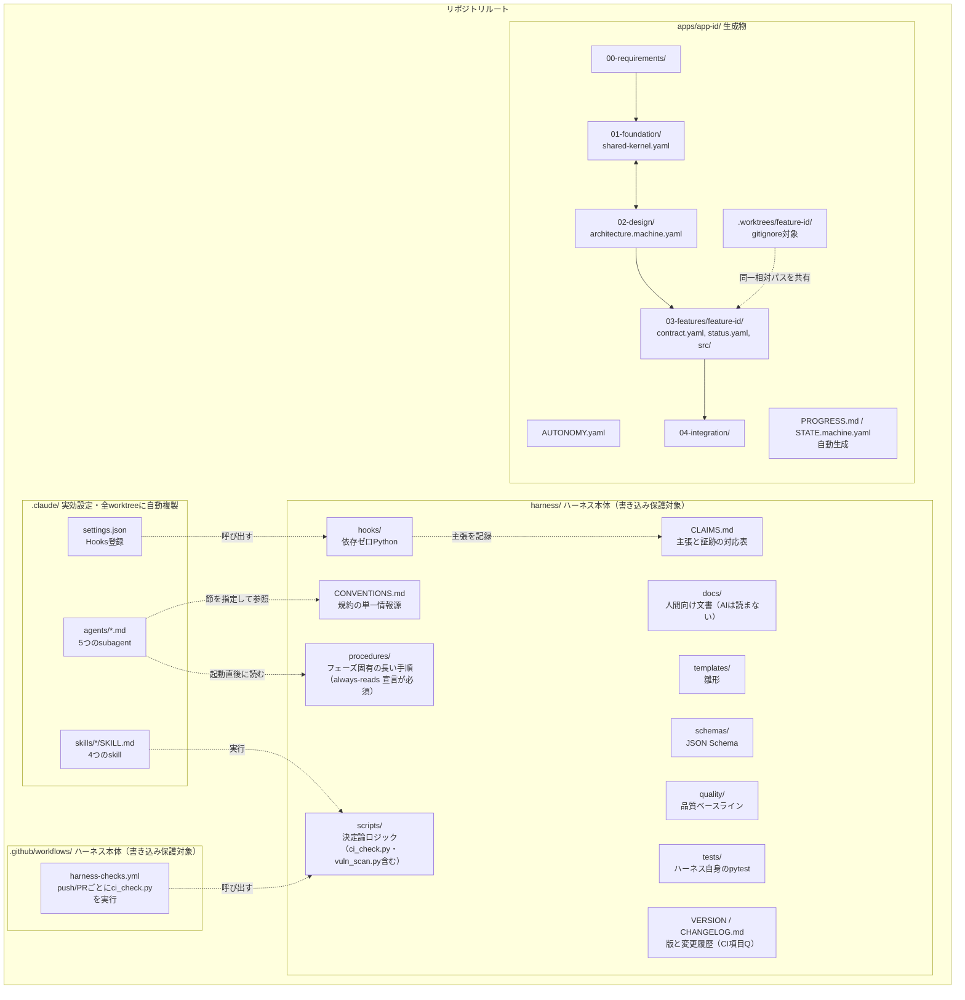
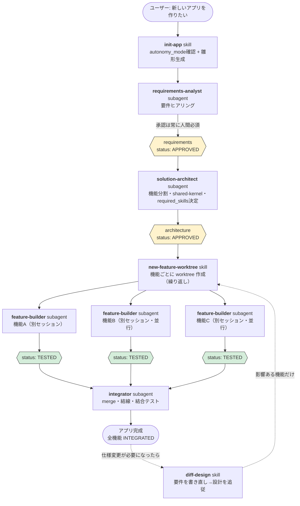
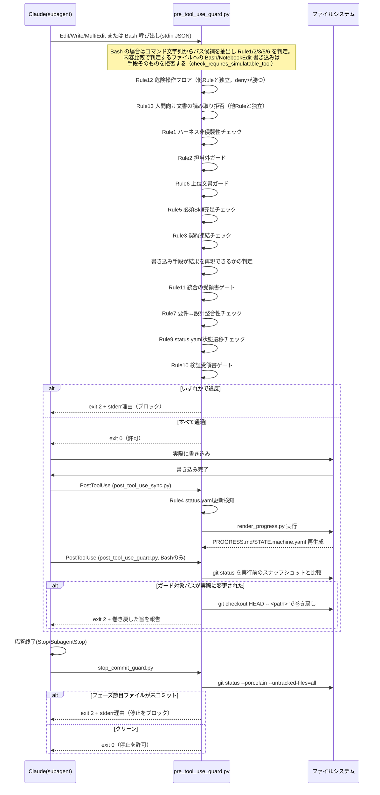
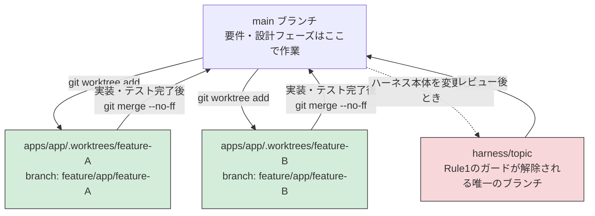
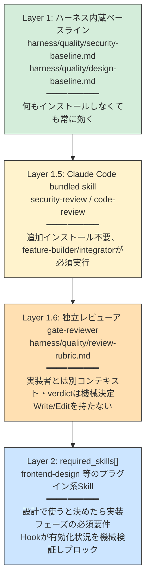
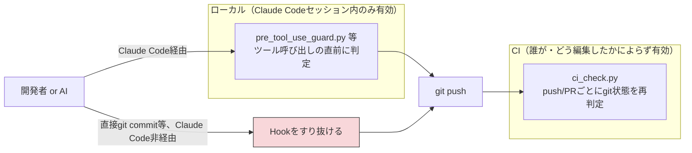
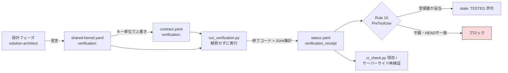
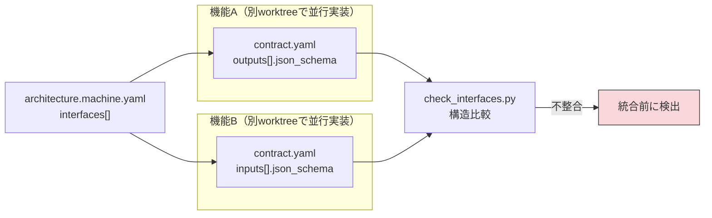
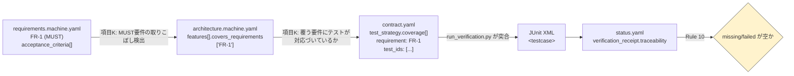
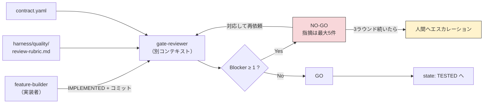

# apparness ハーネス ガイド（しくみ）

> **人間向けの文書です。** AI（Claude Code の agent・skill）はこの文書を読みません（Rule 13）。
> AI は実行物（`harness/hooks/`・`harness/scripts/`・`.claude/`）と `harness/CONVENTIONS.md` から動作を判断します。

アプリを作る人が、ハーネスが「いつ・何を・なぜ止めるのか」を理解するための説明書です。
思想、フェーズごとに動くエージェント・スキル・フック、決定論的に強制される部分と AI の判断に
委ねられる部分の境界、ブランチ運用とその制限をまとめています。

- 使い方（コマンド・トラブル対処）は [USAGE.md](USAGE.md) にあります。
- 図解のやさしい説明は [flow/harness-flow-plain.html](flow/harness-flow-plain.html) にあります。
- 規約そのもの（機械が強制する規範）は [`../CONVENTIONS.md`](../CONVENTIONS.md) です。

---

## 目次

1. [思想](#1-思想)
2. [全体像（ディレクトリマップ）](#2-全体像ディレクトリマップ)
3. [ワークフロー全体図](#3-ワークフロー全体図)
4. [フェーズ詳細](#4-フェーズ詳細)
5. [Hooks が強制する13のルール（決定論レイヤー）](#5-hooks-が強制する13のルール決定論レイヤー)
6. [決定論 vs AI判断 対照表](#6-決定論-vs-ai判断-対照表)
7. [ブランチ・worktree 運用とその制限](#7-ブランチworktree-運用とその制限)
8. [品質保証の多層構造](#8-品質保証の多層構造)
9. [自動化モード（AUTONOMY.yaml）](#9-自動化モードautonomyyaml)
10. [CI連携（サーバーサイド二重チェック）](#10-ci連携サーバーサイド二重チェック)
11. [依存ライブラリの脆弱性スキャン（OSV-Scanner）](#11-依存ライブラリの脆弱性スキャンosv-scanner)
12. [検証コマンドの宣言・実行・受領書（Rule 10）](#12-検証コマンドの宣言実行受領書rule-10)
13. [契約の機械検証（interfaces 突合・要件トレーサビリティ）](#13-契約の機械検証interfaces-突合要件トレーサビリティ)
14. [独立レビューア（gate-reviewer）](#14-独立レビューアgate-reviewer)
15. [スタックパック（スタック固有の標準の外部化）](#15-スタックパックスタック固有の標準の外部化)
16. [知っておくべき制約](#16-知っておくべき制約)


---

## 1. 思想

アプリ作成を AI エージェントに任せると、コンテキストが肥大化するほど精度が落ち、また「約束事項」がAIの自己申告だけに頼ると守られたり守られなかったりが安定しない、という2つの問題が起きます。このハーネスは次の原則でこれに対応します。

| 原則 | 内容 |
|---|---|
| **最小機能単位への分割** | アプリを「入出力さえわかれば内部を知らなくてよい」独立機能に分割し、機能ごとにコンテキストをクリアして作業する |
| **契約ファースト** | 各機能の入出力は `contract.yaml` として先に確定・凍結し、実装はそれだけを見て進められるようにする |
| **並行作業前提** | 機能ごとに `git worktree` を切り、複数人（または複数セッション）が同時に別機能へ取り組める |
| **中断・再開性** | いつ止めても `STATE.machine.yaml`（機械向け）と `PROGRESS.md`（人間向け、自動生成）を見れば続きから再開できる |
| **上位文書優先** | 要件定義 > 設計 > 機能契約の順で重要度が高く、下位だけを直して上位を放置することを許さない |
| **決定論的な強制** | 「守ってほしいこと」は可能な限り Hooks（Pythonスクリプト）で機械的に強制し、AIの遵守任せにしない |
| **ハーネスと生成物の分離** | `harness/`・`.claude/` はテンプレート本体で書き込み保護の対象。生成物は `apps/<app-id>/` に閉じる |


---

## 2. 全体像（ディレクトリマップ）



- `.claude/`・`harness/`・`.github/` を合わせて「ハーネス本体」と呼びます。テンプレートとして繰り返し使い回すことを想定しており、アプリ作成中は原則書き込み禁止です（[7節](#7-ブランチworktree-運用とその制限)）。
- `apps/<app-id>/` はアプリ作成のたびに `init-app` skill が生成する成果物です。

---

## 3. ワークフロー全体図



いつ中断しても、`apps/<app-id>/STATE.machine.yaml`（機械向け）と `PROGRESS.md`（人間向け）を見ればどこで止まっているか・次に何をすべきかが分かります。この2ファイルは `render_progress.py` による自動生成で、手書きはしません。

---

## 4. フェーズ詳細

各フェーズについて、①いつ使われるか ②読み込む/参照するファイル（コンテキスト消費の源） ③決定論的に実行される部分とAIが判断する部分、を整理します。

### 4.1 `init-app` skill

| 項目 | 内容 |
|---|---|
| 使われるタイミング | 新規アプリ作成の開始時。ユーザーが「新しいアプリを作りたい」と言ったとき |
| 読み込むファイル | `harness/CONVENTIONS.md` 9節（自動化モードの説明）、`briefs/<app-id>.brief.yaml`（**企画ブリーフ**。あれば要件定義の出発点。無ければ従来どおり対話） |
| 実行するスクリプト | `harness/scripts/new_app_scaffold.py`（**決定論**：雛形一式の生成、`AUTONOMY.yaml`・`00-requirements/`・`01-foundation/`・`02-design/`・`04-integration/` を作成し `render_progress.py` を呼ぶ）
| | `harness/scripts/check_brief.py`（**決定論**：ブリーフの書式検証と未記入項目の列挙。未記入項目のリストがそのまま要件定義で確認すべき議題になる） |
| AIが判断する部分 | `app_id`/`app_name` の確認、`AskUserQuestion` での `autonomy_mode` 確認（未回答なら `SUPERVISED` を既定にしてよい）、ブリーフの記述と要件の対応づけ |
| 決定論的な部分 | 雛形ファイルの内容そのもの（テンプレートから生成、AIは中身を作文しない） |
| 完了後のコミット | `git add -A && git commit`（AIが実行するが、内容は雛形そのものなので実質固定的） |

### 4.2 `requirements-analyst` subagent

| 項目 | 内容 |
|---|---|
| 使われるタイミング | `init-app` の直後。要件定義フェーズ |
| tools | Read, Write, Edit, Glob, Grep, AskUserQuestion, Bash |
| 読み込むファイル | `harness/CONVENTIONS.md` は読まない（担当範囲の規約はプロンプト本文に書き切ってある）、`apps/<app-id>/00-requirements/requirements.md`・`requirements.machine.yaml`・`brief.yaml`（あれば。記入済みは聞き直さず、未記入だけを対話で補う） |
| 触ってよい範囲 | `apps/<app-id>/00-requirements/` 配下のみ |
| 実行するスクリプト | `harness/scripts/validate_yaml.py`（**決定論**：`requirements.schema.json` に対する検証。更新のたびに実行） |
| AIが判断する部分 | ユーザーとの対話内容（目的・ゴール・機能要件など）、`open_questions` が解消されたかの判断 |
| **決定論で強制される部分** | ①`status: APPROVED` にする際、`approved_by`/`approved_at` が空だと **JSON Schema の `if/then` 制約で弾かれる**。②**要件定義の承認だけは `AUTONOMY.yaml` のモードに関わらず常に人間の明示的な返答が必須**（ただしこれ自体はプロンプト上の指示であり、Hookによる強制ではない＝AIの遵守に依存する） |

### 4.3 `solution-architect` subagent

| 項目 | 内容 |
|---|---|
| 使われるタイミング | 要件承認後。設計フェーズ |
| tools | Read, Write, Edit, Glob, Grep, Bash, WebSearch, WebFetch, AskUserQuestion |
| 読み込むファイル | `harness/CONVENTIONS.md`（6, 9, 10, 11, 12, 13, 14節。`print_conventions.py` で該当節だけ）、`apps/<app-id>/AUTONOMY.yaml`、`00-requirements/requirements.machine.yaml`、`harness/quality/security-baseline.md` |
| 触ってよい範囲 | `apps/<app-id>/01-foundation/` と `02-design/` のみ |
| 進め方の特徴 | `shared-kernel.yaml`（共通部分）と `architecture.machine.yaml`（機能分割）を**逐次ではなく反復**して収束させる（[CONVENTIONS.md 11節](../CONVENTIONS.md)） |
| AIが判断する部分 | 機能分割案、技術スタック選定（ライセンス・脆弱性をWebSearchで調査）、`required_skills[]` に追加するかどうかの判断 |
| **決定論で強制される部分** | ①`status: APPROVED` 時の `approved_by`/`approved_at` 必須（スキーマ）。②**`based_on_requirements_version` が要件の現在の `version` と一致しないと Hook が APPROVED への変更自体を拒否**（Rule 7、正真正銘のブロック）。③APPROVED後は `contract.yaml`（設計時ドラフト）が凍結され Hook が書き込みを拒否（Rule 3） |
| 実行するスクリプト | `harness/scripts/validate_yaml.py` |

### 4.4 `new-feature-worktree` skill

| 項目 | 内容 |
|---|---|
| 使われるタイミング | 設計承認後、機能ごとに実装へ着手するとき（繰り返し実行） |
| 実行するスクリプト | `harness/scripts/new_feature_scaffold.py`（**決定論**：`architecture.machine.yaml` が APPROVED か検証 → `git worktree add` → `SPEC.md`/`contract.yaml`/`status.yaml`/`src/`/`tests/`/`.claude/` を生成 → 初期コミット） |
| AIが判断する部分 | `app_id`/`feature_id` の確認のみ。生成内容自体はテンプレート駆動 |
| 決定論的な部分 | worktree のパス・ブランチ名は固定規則（[7節](#7-ブランチworktree-運用とその制限)）。冪等（既存なら再利用） |

### 4.5 `feature-builder` subagent

| 項目 | 内容 |
|---|---|
| 使われるタイミング | 機能ごとの worktree 内で、担当者が新規セッションを開始したとき |
| tools / skills | Read, Write, Edit, MultiEdit, Bash, Glob, Grep, Skill, Task／`skills: code-review`（frontmatterでプリロード） |
| 読み込むファイル | `harness/procedures/feature-build.md`（起動直後に読む実装手順）、`SPEC.md`、`contract.yaml`、`status.yaml`、`apps/<app-id>/AUTONOMY.yaml`、`harness/quality/security-baseline.md`、（UIありなら）`harness/quality/design-baseline.md`、`../../01-foundation/shared-kernel.yaml`（`required_skills[]` 確認用） |
| 触ってよい範囲 | 自分の `03-features/<feature-id>/` 配下のみ |
| AIが判断する部分 | 実装そのもの、テスト内容、レビュー指摘への対応 |
| **決定論で強制される部分** | ①他機能・要件・共有基盤・設計・ハーネス本体への書き込みは **すべて Hook が拒否**（Rule 1, 2, 6）。②**`src/**` への最初の書き込み時、`required_skills[]` の各Skillが有効化されていなければ実装そのものをブロック**（Rule 5）。③承認済み `contract.yaml` は凍結され書き込み拒否（Rule 3）。④**`TESTED` にするには、宣言された検証コマンドを実際に実行した受領書が必要**（Rule 10、12節）。受領書の手書きも拒否される |
| 実行するSkill / subagent | `code-review`（bundled）＋ `run_verification.py`（受領書の生成）＋ `gate-reviewer` subagent（独立レビュー、14節）。いずれも `TESTED` にする前 |

### 4.6 `integrator` subagent

| 項目 | 内容 |
|---|---|
| 使われるタイミング | 全機能が `TESTED` 以上になった後。メインの worktree（リポジトリ本体）で実行 |
| tools / skills | Read, Write, Edit, Bash, Glob, Grep, Skill／`skills: security-review, code-review` |
| 読み込むファイル | `STATE.machine.yaml`、`architecture.machine.yaml`（`interfaces[]`）、`harness/quality/security-baseline.md`・`design-baseline.md`、`shared-kernel.yaml`（`required_skills[]`） |
| 触ってよい範囲 | 各 feature ブランチの merge、`04-integration/` 配下の結線・テストコード作成 |
| AIが判断する部分 | 結線コードの書き方、結合テストのシナリオ設計 |
| **決定論で強制される部分** | ①merge 前に `check_interfaces.py` で `interfaces[]` の両端の JSON Schema 整合を確認（CI 項目 J でも再検証。13節）。②統合完了直前に `security-review`・`code-review` の実行が手順として必須（プロンプト指示。見つからなければ報告のみで先に進める＝Hookではなく運用ルール） |
| 完了条件 | 結合テストコードを `04-integration/` に資産として残すこと。`integration.md` に手順・結線箇所・テスト結果を記録 |

### 4.7 `diff-design` skill

| 項目 | 内容 |
|---|---|
| 使われるタイミング | 仕様変更・要件追加が必要になったとき |
| 手順 | ①`requirements-analyst` で変更ヒアリング → 旧要件を `00-requirements/history/` に退避 → `version` インクリメント → 承認。②`solution-architect` で新設計（`based_on_requirements_version` 更新）→ 旧設計を `02-design/history/` に退避。③`diff_architecture.py` で機能差分算出（**決定論**）。④変更機能のみ新規 `feature-id` で `new-feature-worktree`、変更なしは再利用 |
| **決定論で強制される部分** | 新しい `architecture.machine.yaml` を APPROVED にする際、Rule 7 が要件versionとの整合性を検証 |

### 4.8 `sync-progress` skill

| 項目 | 内容 |
|---|---|
| 使われるタイミング | 進捗を手動で強制リフレッシュしたいとき（通常は Rule 4 が自動実行するため不要） |
| 実行するスクリプト | `harness/scripts/render_progress.py --app <id>` または `--all`（完全決定論） |

---

## 5. Hooks が強制する13のルール（決定論レイヤー）

`harness/hooks/` の 5 本で実装します。**依存ゼロの標準ライブラリのみ**で動作し、ツール呼び出し・応答終了のたびに毎回起動されます。

| ファイル | イベント | 担当 |
|---|---|---|
| `session_start_healthcheck.py` | SessionStart | 強制レイヤ自身の健全性診断と、git 情報が取れないことによる判定劣化の警告（exit 0 固定） |
| `pre_tool_use_guard.py` | PreToolUse | Rule 1・2・3・5・6・7・9・10・11・12・13 |
| `post_tool_use_sync.py` | PostToolUse | Rule 4（進捗の再生成。非ブロッキング） |
| `post_tool_use_guard.py` | PostToolUse（Bash のみ） | 静的検知をすり抜けた書き込みの事後検知と巻き戻し |
| `stop_commit_guard.py` | Stop / SubagentStop | Rule 8 |

`.claude/settings.json` の `PreToolUse` の matcher は `Edit|Write|MultiEdit|NotebookEdit|Bash|Read|NotebookRead|Grep` です（`Read`/`NotebookRead`/`Grep` が入っているのは、Rule 12 の D-2「秘密ファイルの読み取り」と Rule 13「人間向け文書の読み取り」を止めるためです）。



| # | ルール名 | 何を見るか | ブロック条件 |
|---|---|---|---|
| 1 | ハーネス非侵襲性 | `harness/**`, `.claude/**`, `.github/**` への書き込み | 現在のブランチが `harness/` プレフィックスでない（`.claude/settings.local.json` は例外） |
| 2 | 担当外ガード | `03-features/<id>/**`（`status.yaml`除く） | 現在の worktree のルート basename が `<id>` と不一致 |
| 3 | 契約凍結 | `contract.yaml` | 対応する `status.yaml` の `state` が `CONTRACT_DRAFTED` を超えている |
| 4 | 進捗自動再生成 | `status.yaml` の更新（PostToolUse） | 常に非ブロッキングで `render_progress.py` を実行 |
| 5 | 必須Skill充足ゲート | `03-features/<id>/src/**` | `shared-kernel.yaml` の `required_skills[]` の `plugin_ref` が `enabledPlugins` に無い |
| 6 | 上位文書ガード | feature用worktreeからの `00-requirements/`・`01-foundation/`・`02-design/` | 常にブロック（メインworktreeからは対象外） |
| 7 | 要件↔設計整合性 | `architecture.machine.yaml` を `APPROVED` にする書き込み | `based_on_requirements_version` ≠ `requirements.machine.yaml` の現在の `version` |
| 8 | フェーズ節目のコミット強制 | `status.yaml`/`requirements.machine.yaml`/`architecture.machine.yaml`（Stop/SubagentStop） | いずれかが `git status --porcelain --untracked-files=all` で未コミット |
| 9 | 状態遷移の妥当性チェック | `status.yaml` の `state` 書き換え | 書き込み前後の `state` が妥当な遷移でない（直線状態の後退・複数段階の飛び越し、終端状態からの変更）。`BLOCKED` からの復帰は `state_history[]` を遡って直前の実質的な状態から判定する |
| 10 | 検証受領書ゲート | `status.yaml` を `TESTED` にする書き込み／`verification_receipt` の書き換え | 受領書が無い・宣言されたコマンドが `exit_code: 0` でない・受領書の `commit` が現在の HEAD と不一致／受領書を Edit/Write で書き換えようとした（12節） |
| 11 | 統合の受領書ゲート | `status.yaml` を `INTEGRATED` にする書き込み／`integration.machine.yaml` の受領書の書き換え | `04-integration/integration.machine.yaml` に `interfaces[]` の全エッジを覆う `interface_coverage[]` と有効な受領書（`run_integration_verification.py` 生成）が無い／受領書を手書きしようとした（13節） |
| 12 | 危険操作フロア | Bash コマンド全体と `Read`/`NotebookRead` の対象パス（**他 Rule と独立に判定し、deny が勝つ**） | D-1 リポジトリ外への再帰削除／D-2 秘密ファイルの読み取り／D-3 履歴の破壊／D-4 検証のスキップ／D-5 外部送信／D-6 `sudo` 等（一覧は `CONVENTIONS.md` 7節） |
| 13 | 人間向け文書の読み取り拒否 | `Read`/`NotebookRead`/`Grep` の対象パスと、Bash の読み出しコマンド（`cat`・`grep`・`sed` 等）の引数 | 対象が人間向け文書（配布元では `docs/**`・`harness/docs/**`、導入先では `harness/docs/**`）で、現在のブランチが `harness/` プレフィックスでない |

**判定対象のパスは、`.worktrees/` を通る場合その worktree を基準に読み替えてから Rule に掛けます**
（`path_utils.resolve_worktree_scope`）。7節のとおり worktree の実体は
`apps/<app>/.worktrees/<feature-id>/` にあり、その中に同じ `apps/<app>/03-features/<feature-id>/`
という相対パスが再び現れます。メインの worktree から見た相対パスは接頭辞ぶんだけ深くなるため、
読み替えをしないと `^apps/.../03-features/...` にアンカーされた Rule がまとめて素通りします。
読み替えにより、どのセッションから書いても同じ Rule が同じ意味で効きます。worktree の中から
書いている場合は接頭辞が現れないため、読み替えは恒等写像です。

さらに、**Bash については実行後の事後検証**も行います（`post_tool_use_guard.py`、PostToolUse）。
静的解析では原理的に検知できない書き込み（変数展開されたパス `>> "$VAR"`、`xargs`、
スクリプト経由など）を、Bash 実行前後の `git status` の比較で確実に検出し、ガード対象パスへの
変更であれば**巻き戻して**報告します。実行前から未コミットだったパスは巻き戻しません
（Claude Code の外で行われた人間の編集を破壊しないため）。静的検知（未然防止）と
事後検証（確実な検知）の二段構えです。

**Edit/Write/MultiEdit/NotebookEdit** に加え、**Rule 1・2・3・5・6 は `Bash` 経由の間接書き込み**（`sed -i` / `cp` / `mv` / `tee` / リダイレクト等）**もブロック**します（v1。`shlex` によるクォート考慮トークン化で判定するため、クォート内の文字列（`echo "a >> b"` の `>>` 等）を演算子と誤認識しない。トークン化前にクォート・行継続・ヒアドキュメント本体を考慮して改行をコマンド区切りへ正規化するため、複数行の Bash コマンドで `cp`/`mv`/`tee`/`sed -i` が先頭行以外にある場合も検知する。変数展開されたパス等の検知漏れは残るが許容する。**この Bash 検知に解除用の環境変数は意図的に用意しない**——AIがブロックされた際に自ら解除できてしまうと決定論的強制が崩れるため。解除路があるのは Rule 1 の `HARNESS_UNLOCK=1` だけです（7節））。

**Rule 3・7・9・10・11 は「書き込み前後の内容比較」で判定するため、`Bash`・`NotebookEdit` のように書き込み後の内容を再現できない手段による `status.yaml`・`requirements.machine.yaml`・`architecture.machine.yaml`・`integration.machine.yaml` への書き込みは、手段そのものを拒否します**（`check_requires_simulatable_tool`）。判定基準は「どのツールか」ではなく「`path_utils.simulate_write_result` が結果を再現できるか」なので、将来ツールが増えても既定で拒否側に入ります。

**Rule 8** は例外的に `Stop`/`SubagentStop` イベントで動作し、ツール呼び出しではなく応答終了そのものをブロックします。**Rule 9** は `BLOCKED` から復帰するとき、`state_history[]` を時刻順に遡って直前の非 `BLOCKED` 状態を復元し、そこからの遷移として判定します（`BLOCKED` を経由した飛び越しはできません）。

---

## 6. 決定論 vs AI判断 対照表

「確実に実行される（Hookやスクリプトが機械的に強制する）」ものと「AIが妥当と判断して実行する（プロンプト上の指示に依存する）」ものを区別します。後者は AutonomyMode や状況次第で省略・誤判断されうる点に注意してください。

| 動作 | 決定論（Hook/スクリプトで強制） | AI判断（プロンプト依存） |
|---|---|---|
| ハーネス本体への書き込み拒否 | ✅ Rule 1（PreToolUse） | — |
| 担当外機能ディレクトリへの書き込み拒否 | ✅ Rule 2 | — |
| 契約の凍結 | ✅ Rule 3 | — |
| PROGRESS.md/STATE.machine.yaml の再生成 | ✅ Rule 4（PostToolUse） | — |
| 必須Skillが無い実装のブロック | ✅ Rule 5 | — |
| feature-builderの要件/設計への書き込み拒否 | ✅ Rule 6 | — |
| 要件と設計のバージョン不整合を APPROVED にさせない | ✅ Rule 7 | — |
| status.yaml の state 遷移の妥当性（飛び越し・後退・終端状態からの変更） | ✅ Rule 9（`BLOCKED` からの復帰は `state_history[]` を遡って判定） | — |
| `approved_by`/`approved_at` の未入力での承認防止 | ✅ JSON Schema `if/then` | — |
| YAML/JSON構文・スキーマ適合の検証 | ✅ `validate_yaml.py` | — |
| worktree・雛形ファイルの生成 | ✅ `new_app_scaffold.py`/`new_feature_scaffold.py` | — |
| 機能差分の算出 | ✅ `diff_architecture.py` | — |
| **要件定義の最終承認を人間が明示的に行ったか** | ❌ | ⚠️ プロンプトの指示のみ（Hookは対話の意味を判定できない） |
| 自動化モード（MANUAL/SUPERVISED/AUTONOMOUS）に応じた確認頻度 | ❌ | ⚠️ subagentが `AUTONOMY.yaml` を読んで自己判断 |
| 機能分割の粒度・独立性の妥当性 | ❌ | ⚠️ `solution-architect` の設計判断 |
| 技術スタックの安全性（脆弱性・保守状況）評価 | ❌ | ⚠️ WebSearchに基づくAI判断 |
| 宣言された検証コマンド（テスト/ビルド/型チェック/Lint）を実際に実行して通したか | ✅ Rule 10 ＋ 受領書の `commit` 一致（12節） | — |
| テストが空振り（0件）していないか・スキップ率 | ✅ JUnit XML の集計値（`junit_xml` を宣言した場合。12節） | ⚠️ 宣言しない技術を選んだ場合は終了コードのみ |
| 受入基準に対応づけたテストが実在し成功したか | ✅ `test_ids` と JUnit XML の突合（13節） | — |
| MUST 要件の取りこぼし | ✅ CI 項目 K（`covers_requirements`。13節） | — |
| 並行実装した機能間の入出力の食い違い | ✅ CI 項目 J（`interfaces[]` の JSON Schema 突合。13節） | — |
| 実装者以外によるレビューが行われたか | ⚠️ `gate-reviewer` は必須手順だが、実行記録（`status.yaml` の `review`）は証明を持たない（14節） | ⚠️ プロンプト上の必須手順 |
| `security-review`/`code-review` の実行そのもの | ❌ | ⚠️ プロンプト上の必須手順（実行を忘れる/スキップする余地は理論上ある） |
| 実装の正しさ・テストの**内容の**十分性（そのテストが受入基準を実際に検証しているか） | ❌ | ⚠️ `gate-reviewer` の rubric 判定（verdict の集計は機械的だが、指摘そのものはAI判断） |
| 結合テストのシナリオ網羅性 | ⚠️ 接続の型整合は CI 項目 J が担保 | ⚠️ シナリオの選び方は integrator の判断 |
| フェーズ節目（status.yaml等）のコミット実行 | ✅ Rule 8（Stop/SubagentStop） | — |
| コミット内容の妥当性（メッセージ・粒度） | ❌ | ⚠️ プロンプトの指示に依存（コミットが行われること自体はRule 8が強制） |
| Bash経由の間接的な書き込み（Rule1/2/3/5/6相当） | ✅ 静的検知でブロック ＋ 事後検証（`git status` 比較）で巻き戻し（バイパス用環境変数なし） | — |
| 内容比較で判定するファイルを、結果を再現できない手段（Bash / NotebookEdit）で書くこと | ✅ 手段そのものを拒否（`check_requires_simulatable_tool`。5節） | — |
| 全機能を結線した結合テストを実際に実行して通したか | ✅ Rule 11 ＋ 統合受領書の `commit` 一致と `interface_coverage[]` の全エッジ充足（13節） | — |
| 危険操作（リポジトリ外への再帰削除・秘密ファイルの読み取り・履歴の破壊・検証のスキップ・外部送信・`sudo`） | ✅ Rule 12（他 Rule と独立に deny。確認ではなく拒否） | ⚠️ 変数展開・エイリアス・自作スクリプト経由の間接実行は静的検知の原理的限界 |
| AI が人間向けの説明文を根拠に作業すること | ✅ Rule 13（人間向け文書の読み取りを拒否）＋ CI 項目 R（AI が読む文書からの参照を検出） | ⚠️ 範囲を絞らない検索に混ざる行・作業ディレクトリ移動後やスクリプト経由の読み取りは止めない |
| 常時読み込みコンテキストの肥大化 | ✅ CI 項目 L（コンテキスト予算） | — |
| 強制レイヤ自体が壊れていないか | ✅ SessionStart の自己診断＋`PROGRESS.md` 表示。ガードは判定できないとき通過ではなく拒否（fail-closed） | ⚠️ Hook の**起動**自体が失敗した場合はハーネスから止められない（16節） |
| git 情報が取れない環境での判定の劣化 | ⚠️ 止めずに**警告する**（SessionStart。影響を受ける Rule と倒れる向きを名指しする） | — |

**読み方**: ✅ は「Claudeが指示に従わなくても、システムが機械的に阻止/実行する」層。⚠️ は「プロンプトに明記されているが、最終的にはAIの遵守に依存する」層です。⚠️ の項目は `PROGRESS.md` の `autonomy_mode` 表示や、人間によるレビューで補完することを前提としています。

**据え置いた項目**: 「機能分割の粒度・独立性の妥当性」と「要件定義の最終承認を人間が行ったか」は、意図的に AI 判断のまま残しています。前者は設計判断であり機械化すると設計の自由度そのものを削ります。後者は Hook が対話の意味を判定できないという構造的な限界です（8節・9節）。

---

## 7. ブランチ・worktree 運用とその制限



### ブランチ命名規則

| 用途 | 形式 | 例 |
|---|---|---|
| アプリ雛形作成 | `app/<app-id>/bootstrap` | `app/hello-world-todo/bootstrap` |
| 機能実装 | `feature/<app-id>/<feature-id>` | `feature/hello-world-todo/todo-list-api` |
| ハーネス保守 | `harness/<topic>` | `harness/fix-progress-renderer` |
| 統合作業（任意） | `integration/<app-id>` | `integration/hello-world-todo` |

### worktree パス規則

```
apps/<app-id>/.worktrees/<feature-id>/apps/<app-id>/03-features/<feature-id>/   ← 担当者はここをcwdにする
```
git worktree は同一リポジトリの追跡ファイルをそのままチェックアウトするため、worktree内にも `apps/<app-id>/03-features/<feature-id>/` という同一の相対パスが現れます。ルート直下の `.claude/`（hooks/agents/skills）もこの複製に含まれるため、**追加設定なしに全worktreeで同じHooksが有効**になります。

### ブランチによる制限（Rule 1 との関係）

| 現在のブランチ | `harness/**`・`.claude/**`・`.github/**` への書き込み（Rule 1） | 人間向け文書の読み取り（Rule 13） |
|---|---|---|
| `main` またはその他 | ❌ 拒否（`HARNESS_UNLOCK=1` で一時解除可能） | ❌ 拒否 |
| `harness/<topic>` | ✅ 許可 | ✅ 許可 |
| feature用worktree（`feature/...`） | ❌ 拒否。かつ Rule 6 により要件・共有基盤・設計文書も拒否 | ❌ 拒否 |

つまり、**ハーネス本体を変更してよいのは `harness/<topic>` ブランチだけ**です。

---

## 8. 品質保証の多層構造

「専門的な外部Skillが入っていない環境では品質が保証されない」状態を避け、かつ「実装者が自分で自分を通す」ことも避けるための構造です。



- **Layer 1**は依存ゼロで常に効く最低ライン。`CONVENTIONS.md` には内容を埋め込まず、該当フェーズで初めて `Read` される（コンテキストは必要なときだけ消費）。
- **Layer 1.5**は Claude Code 標準搭載のため基本的に確実。実行を試みて見つからない場合はユーザーに報告して続行（Layer 1 が最低ラインを担保するため）。
- **Layer 1.6** は `feature-builder` の自己レビュー（Layer 1.5）に残る**作者バイアス**を
  打ち消すための独立レビューアです。`state: TESTED` の前に、実装者とは別のコンテキストで
  契約とコードだけを突き合わせます。判断基準は `harness/quality/review-rubric.md` **だけ**、
  verdict は深刻度の集計から機械的に決まり、レビューアは `Write`/`Edit` を持ちません。詳細は 14 節。
- **Layer 2**は「あれば使う」ではなく「**設計で決めたら実装フェーズの必須要件**」という位置づけです。`solution-architect` が `shared-kernel.yaml` の `required_skills[]` に記録すると、`feature-builder` は実装開始前に Hook（Rule 5）で有効化状況を機械的に検証され、欠けていれば実装そのものがブロックされます。`feature-builder` は `shared-kernel.yaml` を書き換えられない（Rule 6）ため、実装中に必要なSkillに独断で気づいても追加できず、`diff-design` での再設計に回る設計です。

---

## 9. 自動化モード（AUTONOMY.yaml）

`apps/<app-id>/AUTONOMY.yaml` が、そのアプリでどこまで人間の承認を必須とするかを定めます。

| モード | 節目ごとの確認頻度 |
|---|---|
| `MANUAL` | 要件承認・設計承認・各機能の完了・統合完了、すべての節目で毎回人間に確認 |
| `SUPERVISED`（デフォルト） | 要件承認は必須。それ以降は妥当なら自動で進めるが、技術スタック選定など重要な決定は都度提示 |
| `AUTONOMOUS` | 明らかにブロッキングな疑問がない限り最後まで確認なしで進める |

**モードに関わらず、要件定義の承認だけは常に人間必須**という固定ポリシーがあります。ただし前述の通り、この「人間が本当に承認したか」の判定はHookでは検証できず、プロンプト上の指示に依存します。`PROGRESS.md` に現在のモードが常時表示されるので、実際の挙動とモード設定が食い違っていないか人間が随時確認できるようにしています。

---

## 10. CI連携（サーバーサイド二重チェック）

`harness/hooks/*.py` の Hook は **Claude Code のセッション内でのみ**効く。人間が直接
`git commit` したり、Claude Code を経由しない別ツールで編集した場合はすり抜けられる。
複数人での共有・配布を前提にすると、「Claude Codeを使った人だけが規約を守る」という状態は
避けたい。そこで `.github/workflows/harness-checks.yml` が `harness/scripts/ci_check.py` を
push・pull_request のたびに実行し、git リポジトリの最終状態（および比較対象コミットとの差分）
に対して Hook ルールの一部を**サーバーサイドで再検証**する。



### チェック内容

`harness/scripts/ci_check.py` が行う **17 項目**（A〜G, I〜R。H は欠番）と、対応する Hook Rule（5節）:

| # | チェック内容 | 対応する Hook Rule | 判定方法 |
|---|---|---|---|
| A | machine-readable YAML の JSON Schema 検証 | （Hookでは未実施。`validate_yaml.py` を各subagentがBashで手動実行する運用だったものをCIで機械化） | `harness/schemas/*.json` に対して `jsonschema` で検証 |
| B | `harness/**`・`.claude/**`・`.github/**` への変更は `harness/<topic>` ブランチでのみ許可 | Rule 1 | 比較対象コミットとの `git diff --name-status` とブランチ名 |
| C | `feature/<app>/<feature-id>` ブランチは自分の機能ディレクトリ（と任意featureの`status.yaml`）以外を変更できない | Rule 2 / Rule 6 | 同上 |
| D | `contract.yaml` の変更は、対応する状態が凍結ライン未満のときのみ許可 | Rule 3 | 変更ファイル一覧 + 現在の `status.yaml`/`architecture.machine.yaml` |
| E | `architecture.machine.yaml` が `status: APPROVED` のとき `based_on_requirements_version` が一致 | Rule 7 | 最終状態のみで判定（diff不要） |
| F | `status.yaml` の `state` 遷移の妥当性 | Rule 9 | 比較対象コミットの旧内容（`git show`）と現在の内容 |
| G | `PROGRESS.md`/`STATE.machine.yaml` が `render_progress.py` の出力と一致（鮮度） | （Rule 4 のPostToolUse自動再生成を経ずにコミットされていないか） | `render_progress.py` を実行して差分比較（生成日時行は除外） |
| I | `state` が `TESTED`/`INTEGRATED` の機能に妥当な `verification_receipt` があり、検証を実行したコミット以降に実装が変更されていない | Rule 10 | 受領書の `commit` が HEAD の祖先か + `git diff <commit> HEAD -- <機能ディレクトリ>` が空か + 終了コード・JUnit集計値 |
| J | `interfaces[]` の両端の JSON Schema が構造的に整合している | （Hookでは未実施。並行実装中の食い違いを統合前に検出する。13節） | `check_interfaces.py` による型・必須項目・enum の包含関係の比較 |
| K | 要件 → 機能 → テストのトレーサビリティ | （Hookでは未実施。13節） | `check_traceability.py`。MUST 要件の取りこぼし・存在しない FR ID・覆う要件にテストが対応づいていないケース |
| L | コンテキスト予算 | （Hookでは未実施） | `CONVENTIONS.md` と `.claude/agents/*.md` 各ファイルのバイト数、および「agent プロンプト ＋ 読むと宣言した節 ＋ `always-reads` の手順書」の合計を上限と比較。`procedures/` を無宣言で読ませていても不合格 |
| M | 規範と手順の二重管理 | （Hookでは未実施。`CONVENTIONS.md` 15節） | `CONVENTIONS.md` と `.claude/agents/*.md`・`.claude/skills/*/SKILL.md` の段落をほぼ同一かどうかで比較（言い換えを伴う重複は検出しない） |
| N | `interfaces[]` の全エッジが結合テストに対応づけられているか | Rule 11（宣言レベル） | `check_integration_traceability.py`。実行結果の真偽は `run_integration_verification.py` が JUnit XML と突合する |
| O | `CONVENTIONS.md` への節の新設拒否 | （Hookでは未実施） | `## <数字>.` の見出し数が 15 のままかを検証（節の削除・既存節の変更は対象外） |
| P | `CLAIMS.md` と実体の drift | （Hookでは未実施） | 表に書かれた `<file>.py::<test>` が `harness/tests/` に実在するか。実証テストが `—` の行に「未実証の残余」が書かれているか |
| Q | `harness/VERSION` / `harness/CHANGELOG.md` の追随 | （Hookでは未実施） | `harness/`・`.claude/`・`.github/` に差分のあるコミットで、`harness/CHANGELOG.md` が変更ファイルに含まれ、`## [Unreleased]` に `- ` 始まりの項目が 1 件以上あるか、`harness/VERSION` も変更されていてその版の `## [<版>]` 節があるか（リリース・導入の場合。内容の妥当性は見ない） |
| R | AI が読む文書から人間向け文書への参照 | Rule 13（誘導の側） | agent・skill・手順書・`CONVENTIONS.md`・`quality/`・`STACK_PACK.md` の各行に `docs/`・`harness/docs/` が現れたら不合格。同じ行に「人間向け」とあれば許可 |

**H は欠番です。** `ci_check.py` にも `CLAIMS.md` にも H の項目は存在しません
（経緯は記録に残っていません）。記号は `CLAIMS.md`・CI の出力・過去の記録が参照する
安定した識別子なので、繰り上げずに欠番のまま維持します。

Rule 5（必須Skillの充足）は CI 実行環境に Skill 有効化状態という概念が存在しないため、
Rule 8（フェーズ節目のコミット強制）は push された時点で既に全てコミット済みのため、
それぞれ再検証の対象外（再検証しても意味がない）。

なお `vuln-scan` job（依存ライブラリの脆弱性スキャン）はこの 17 項目には含まれません。
Hook 規約の遵守ではなく別の関心事なので、独立した job として動きます（11節）。

**B は `main`/`master` ブランチでは判定しない。** このハーネスは `harness/<topic>` で作業して
`main` へ **fast-forwardマージ**する運用が前提（7節）。fast-forward マージは履歴が線形になるため、
push 時点で「このコミットが元々どのブランチで作られたか」は git 上から判別できない
（正当な `harness/<topic>` の ff マージも、`main` への直接コミットも、diff 上では区別がつかない）。
B は `feature/**` 等の
非デフォルトブランチからの push・PR でのみ意味を持つ（feature-builder が担当外のセッションで
harness/ をローカル Hook 経由せず直接編集した場合等はここで検知できる）。

### トリガーとブランチ保護

`.github/workflows/harness-checks.yml` は `push`（全ブランチ）と `pull_request` の両方で
起動する。**現時点ではブランチ保護ルール（CI成功をマージ必須にする）は設定していない**
（GitHub側のリポジトリ設定変更は影響範囲が大きいため、可視化のみに留めている。必須化したい
場合は別途相談）。

---

## 11. 依存ライブラリの脆弱性スキャン（OSV-Scanner）

`apps/<app-id>/` 配下で使われる依存ライブラリ（npm・pip・その他のパッケージマネージャ）に
既知の脆弱性が無いかを、[OSV-Scanner](https://github.com/google/osv-scanner) を使って
push・PR のたびに機械的に再検証する（`harness/scripts/vuln_scan.py`、
`.github/workflows/harness-checks.yml` の `vuln-scan` job）。

### 位置づけ（8節の品質保証の多層構造との関係）

`security-review`/`code-review` bundled skill（Layer 1.5）と同じ「入っていれば使う、
入っていなければ報告して続行する」という非致命的な位置づけにする。`vuln_scan.py` は
`osv-scanner` バイナリが見つからない場合、エラーにはせずその旨を報告して exit 0 で抜ける。
CI ワークフロー側では `vuln-scan` job が毎回バージョン固定（チェックサム検証付き）で
インストールしてから呼ぶため、CI 上では実質的に必ず実行される。ローカルで開発者が
`osv-scanner` を任意にインストールしていれば `python3 harness/scripts/vuln_scan.py`
（または `--app <app-id>`）でそのまま手元でも実行できる（`ci_check.py`・
`validate_status_transition.py` と同じ「人間/CI 両対応」の設計）。

### スコープと既知の簡略化

- 走査対象は `apps/` 配下のみ。ハーネス自身が使う Python 依存
  （`harness/requirements.txt` の pyyaml/jsonschema）は対象外
  （このスキャンは「生成されるアプリ」の依存が対象で、ハーネス自体の保守用依存ではないため）。
- 機能ごとに独立した worktree（`03-features/<id>/`）や統合後の `04-integration/assembly/` を
  区別せず、`apps/` 全体を横断的に再帰走査する。feature 境界を意識する必要はない
  （`CONVENTIONS.md` 6節の「入出力さえわかれば内部を知らなくてよい」独立性の原則と整合的）。
- 脆弱性が1件でも見つかれば `vuln-scan` job は失敗（exit 1）するが、10節と同様に
  ブランチ保護は設定していないため、現時点ではマージを機械的にブロックはしない
  （可視化のみ）。深刻度（CVSS）によるしきい値判定は v1 では持たない。
  対応不能な検出の受容は次の「抑制」で扱う。
- Rule 5・8 と同様、CI 実行環境に閉じた話であり、Hook との二重化は行わない
  （そもそも Hook 側にこのチェックは存在しない）。

### 抑制 — `apps/<app-id>/.vuln-ignore`（期限と理由が必須）

上流に修正が出ていない脆弱性は、こちらが何をしても消せません。逃げ道が 1 つも無いと、
その 1 件でアプリは CI を永久に通せなくなり、運用側は最終的に `vuln-scan` job 自体を外すか、
赤いまま無視する運用に倒れます。**検査が形骸化する形で壊れる**のがいちばん悪いので、
受容を記録できる経路を用意します。ただし「とりあえず無視」が恒久化すると、それはそれで
検査の意味が消えるため、**期限と理由を必須**にします。

書式（`apps/<app-id>/.vuln-ignore`、1 行 1 件）:

```
# 行頭 # はコメント。空行は無視される
GHSA-xxxx-yyyy-zzzz  expires=2026-12-31  reason=上流に fix 未提供。追跡: https://github.com/…/issues/123
CVE-2026-0001        expires=2026-10-01  reason=当該コードパスを使っていない。撤去 PR: #45
```

- `<ID>` は OSV の ID（`GHSA-…` / `CVE-…` など）。`vuln_scan.py` は単なる文字列として
  突き合わせるだけで、エコシステムごとの分岐は持ちません（単一ツールに寄せた判断と同じ理由）。
  OSV-Scanner の出力の `ids` と `aliases` のどちらに現れても一致します。
- `expires` と `reason` は**両方必須**、この順序で書きます。`reason` は行末まで読むため、
  URL に `#` が含まれていて構いません（その代わり行内コメントには対応しません）。
- 抑制はそれを置いたアプリの配下にしか効きません。別アプリの検出は消えません。

判定の順序と失敗の仕方:

1. **抑制ファイルの検証が先**。`expires` か `reason` の欠落、日付の書式違反、実行日より
   過去の `expires` が 1 件でもあれば、**走査結果に関わらず** exit 1 になり、
   ファイル名・行番号・理由が stderr に出ます。検出が 0 件でも落ちます
   （「たまたま検出が無かった」ために期限切れの抑制が生き残ることを防ぐため）。
2. 検証を通った抑制だけが走査結果に適用されます。除外した検出は**黙って消さず**、
   ID・`expires`・`reason`・出典行を標準出力に列挙します。

`.vuln-ignore` が無い場合の挙動は従来と完全に同一です。置き場所をハーネス本体ではなく
`apps/<app-id>/` にしているのは、これがハーネスの規範ではなく**アプリ側の受容判断**であり、
その寿命がアプリと一致するからです（`CONVENTIONS.md` には節を足していません）。

---

## 12. 検証コマンドの宣言・実行・受領書（Rule 10）

「テストを書いて通した」という主張を AI の自己申告に委ねないための仕組みです。
**アプリ非依存性を一切損なわずに実行ベースの検証を導入する**ことがこの設計の要点です。



### 宣言 → 実行 → 受領書 → ゲート

規約の詳細（宣言できるキー・受領書の形・CI 側の等価条件）は
`harness/CONVENTIONS.md` 12 節を単一の情報源とします。要点だけ記すと:

1. **宣言**: `solution-architect` が技術スタックを決めるのと同じ場所で
   `verification.test_command` 等を宣言する。`test_command` は必須。
2. **実行**: `feature-builder` が実装をコミットしてから
   `python3 harness/scripts/run_verification.py --app <app-id> --feature <feature-id>` を実行する。
3. **受領書**: 結果が `status.yaml` の `verification_receipt` に記録される。
   **手書きはできない**（Rule 10 が Edit/Write によるこのブロックの変更を拒否する）。
4. **ゲート**: `state: TESTED` への書き込みは、受領書が存在し、宣言された全コマンドが
   `exit_code: 0` で、`commit` が現在の HEAD と一致する場合のみ許可される。

**`commit` の一致条件が本質です。** これが無ければ、実装を書き換えた後も過去の成功記録を
使い回して `TESTED` を宣言できてしまいます。受領書は「そのコミットの状態で通った」という
主張であり、コミットが進めば無効化されなければなりません。

### Rule 10 と Rule 8 の順序

受領書を書いた `status.yaml` を先にコミットすると HEAD が進んでしまい、`受領書の commit != HEAD`
で Rule 10 に弾かれます。かといって未コミットのまま応答を終えようとすると、今度は Rule 8
（未コミット状態での停止拒否）に止められます。したがって「実装をコミット → 検証を実行 →
（受領書ができた `status.yaml` を）**コミットせずに** `state: TESTED` を書く → 最後に 1 回で
コミット」の順序を守る必要があります。検証が失敗した場合は `state: TESTED` へは進めないため、
失敗した受領書だけをその場でコミットしてかまいません（次の修正はその上に積む）。

### JUnit XML — 非依存化の技術的な鍵

`verification.junit_xml` を宣言すると、ハーネスは XML を読むだけで**言語を知らずに**
空振り（`tests="0"` を成功と呼んでいないか）・失敗・スキップ率を判定します。
JUnit XML は pytest / jest / vitest / go-test（`go-junit-report`）/ cargo（`cargo2junit`）/
JUnit / RSpec / PHPUnit がいずれも出力できる事実上のクロススタック標準です。

宣言方式なので、**JUnit XML を出せない技術を選んだ場合は `junit_xml` を宣言しなければよい**。
その場合これらの判定だけが無効になり、終了コードによるゲートは効き続けます
（非依存性を段階的に degrade させる設計）。

---

## 13. 契約の機械検証（`interfaces` 突合・要件トレーサビリティ）

`contract.yaml` の `inputs[].json_schema` / `outputs[].json_schema` と、
`requirements.machine.yaml` の `functional_requirements[].id`（`^FR-[0-9]+$`）は、
いずれも**既にスキーマで固定された機械可読な宣言**です。JSON Schema の構造比較も ID の
照合も完全にスタック非依存なので、追加の技術選定なしに機械検証できます。

### `interfaces[]` の JSON Schema 突合（`check_interfaces.py` / CI 項目 J）

apparness は機能ごとに独立した worktree で**並行実装**することを前提にしています（7節）。
そのため「機能 A の出力」と「機能 B の入力」の食い違いは、現状 `integrator` が merge して
初めて露見します。**並行作業の規模が大きいほど手戻りが増える構造**であり、統合前に検出できる
ことの価値は apparness 自身の設計に固有のものです。



判定内容（いずれも「producer の値域 ⊆ consumer の受入範囲」という共変の向きで見る）:

| 観点 | 例 |
|---|---|
| 端点の実在 | `producer_feature` が `features[]` に無い、`producer_output` が `outputs[]` に無い |
| 型の一致 | producer が `["string","null"]` を出しうるのに consumer が `string` しか受けない |
| 必須項目の包含 | producer が出さない項目・出すとは限らない項目を consumer が `required` にしている |
| `enum` の包含 | producer が出しうる値を consumer の `enum` が受け付けない |

どちらかが制約を書いていない箇所は**判定不能として何も言いません**
（過検出でチェックが信用されなくなるほうが害が大きいため）。

実行タイミングは 3 か所です。`solution-architect` が設計中に（契約ドラフトを揃えるため）、
`integrator` が merge の前に（結線コードで辻褄を合わせてしまう前に）、そして CI の項目 J。

```
python3 harness/scripts/check_interfaces.py [--app <app-id>]
```

### 要件 → 機能 → テスト のトレーサビリティ（`check_traceability.py` / CI 項目 K）

`requirements.machine.yaml` の `functional_requirements[].id` は `^FR-[0-9]+$` で既に固定
されています。ここに `architecture.machine.yaml` の `features[].covers_requirements` と
`contract.yaml` の `test_strategy.coverage[]` を接続すると、**要件の取りこぼし**と
**受入基準に対応するテストの不在**が機械検出できるようになります。



これにより「テストが実在して通った」（12節）に加えて、**「受入基準に対応するテストが実在して
通った」**ところまで機械検証できます。「実装したと主張しているが裏付けが無い」「テストで
覆われていないコードがある」といった、通常はスタック固有のカバレッジツールに頼る検査の一部を、
スタック非依存のまま得たことになります。

`test_ids` の書式はハーネスが規定しません（pytest / jest / JUnit / RSpec いずれの流儀でも、
`<testcase>` の `classname`/`name`/`file` から組み立てられる代表的な形と一致すれば通る）。

### 残る AI 判断

トレーサビリティが保証するのは「宣言された対応づけが嘘でないこと」までです。
**「その受入基準に対してそのテストが妥当か」は依然として AI（と人間）の判断**であり、
そこは 14 節の独立レビューアが扱います。

---

## 14. 独立レビューア（`gate-reviewer`）

12 節（受領書）と 13 節（トレーサビリティ）で機械化できるのは、**「テストが実在して通った」**
**「受入基準に対応づけられている」**ところまでです。「そのテストが受入基準を実際に検証して
いるか」「契約の意図から外れていないか」は、依然として判断を要します。

その判断を**実装者自身**に委ねている限り、作者バイアスが残ります（自分が書いたコードは
自分では正しく見える）。`feature-builder` が自ら `code-review` skill を呼ぶ現在の形は、
定義上**自己レビュー**です。

そこで `state: TESTED` の前に、実装者とは**別のセッション・別のコンテキスト**で動く
`gate-reviewer` subagent が審査します。これは**プロセスであってスタックではない**ため、
アプリ非依存性を損なわずに導入できます。



### 決まっていること

- 判断基準は `harness/quality/review-rubric.md` **だけ**。rubric 外の指摘は無効です。
- 軸はスタック非依存のものだけです（契約準拠・テスト十分性・セキュリティ・独立性・デザイン）。
- verdict は深刻度の集計から機械的に決まります（Blocker ≥ 1 → NO-GO）。
- 1 ラウンドの指摘は最大 5 件、3 ラウンド NO-GO が続いたら人間へエスカレーションします。
- レビューアは `Write`/`Edit` を持ちません。直すのは実装者です。

### `status.yaml` の `review` は記録であって証明ではない

審査結果は `status.yaml` の `review`（`verdict`/`rounds`/`blockers`/…）に記録しますが、
**検証受領書（12節）と違い、実行の裏付けを持ちません**。Rule 10 のような機械的ゲートには
していません（AI が書いた値を AI が検証しても意味がないため）。人間が `PROGRESS.md` を
見たときに「どのラウンドで通ったのか」を追えるようにするための記録です。

---

## 15. スタックパック（スタック固有の標準の外部化）

ハーネス本体は特定の技術スタックの流儀を規定しません。「Python ではこう書く」といった
スタック固有の標準は、**外部プラグイン（スタックパック）として接続**します。ハーネスが
規定するのはパックの形式だけで、中身は規定しません。

### 受け口は既にある

新しい強制機構は要りません。既存の Rule 5 と Rule 6 がそのまま使えます。

```mermaid
flowchart LR
    SA["solution-architect<br/>技術スタックを決定"] -->|required_skills[] に<br/>kind: stack-pack で登録| SK["shared-kernel.yaml"]
    SK --> R5{"Rule 5<br/>src/** への最初の書き込み時"}
    R5 -->|plugin_ref が有効化されている| IMPL["実装を許可"]
    R5 -->|欠けている| BLOCK["実装をブロック<br/>インストール手順を提示"]
    SK -.->|Rule 6: feature-builder は<br/>書き換えられない| FB["feature-builder"]
    style BLOCK fill:#f8d7da,stroke:#333
```

不足していたのは「**パックが満たすべきインターフェースの定義**」だけでした。
規定すべきは*パックの形式*であって*パックの中身*ではありません。
仕様は `harness/STACK_PACK.md` にあります。

| 規定する（形式） | 規定しない（中身） |
|---|---|
| 命名（`<stack-id>-stack-pack`）、1 パック = 1 スタック | どのライブラリを推奨するか |
| 必須の記載項目 5 つ（バージョン下限とその根拠 / 禁止パターン / `verification.*_command` の推奨値 / テスト規約 / ライブラリ選定の指針） | それぞれに何を書くか |
| `harness/quality/*.md` との優先関係（ベースラインが常に優先） | パック内のルールの内容 |

`gate-reviewer` はパックを読みません。**パックは実装時に `feature-builder` が従う指針であって、通過判定の基準ではありません。**

### 下限は常にハーネスが持つ

`required_skills[]` が空でも、`harness/quality/*.md`（Layer 1）と Rule 10 の検証受領書は
そのまま効きます。**スタックパックは品質の上積みであって、下限を担保するものではありません。**

---

## 16. 知っておくべき制約

使っていて出会う可能性のある制約です。原因・緩和策・再検討の条件は、保守者向けの
`docs/DESIGN.md`（配布元リポジトリにのみあります）にまとめています。

- **Hook の起動そのものが失敗すると止められない。** `python3` が見つからない等で Hook が起動に
  失敗すると、Claude Code はそれを「通過」として扱います。セッション開始時の自己診断と
  `PROGRESS.md` 先頭の「強制レイヤ」の表示で気付けるようにしています。
- **Claude Code を経由しない編集には Hook が効かない。** 人間が直接 `git commit` した変更などは、
  CI（10節）で再検証します。
- **「本当に人間が承認したか」は機械では判定できない。** 承認記録（`approved_by`/`approved_at`）の
  同時性までは強制しますが、書いたのが人間かどうかは判定できません。
- **Claude Code 以外のホスト、既存リポジトリでの日常開発には対応しません。**
- **git 情報が取れない場所では一部の Rule が判定不能になる。** 自己診断が影響する Rule と、
  通過・拒否のどちらに倒れるかを警告します。
- **Bash の静的検知は変数展開されたパスを判定できない。** 書き込みは事後検証で巻き戻しますが、
  読み取り（Rule 12 D-2・Rule 13）は事後に検知できません。
- **人間向け文書の読み取り拒否（Rule 13）は、範囲を絞った読み取りだけを止めます。** リポジトリ全体への
  検索結果に文書の行が混ざること、作業ディレクトリを移動してからの読み取り、スクリプト経由の
  読み取りまでは止めません。
- **CI はアプリのテストを実際には走らせません。** 受領書のコミットと、その後に実装が変わっていない
  ことを検証します。
- **`gate-reviewer` の審査結果は記録であって証明ではありません。**

